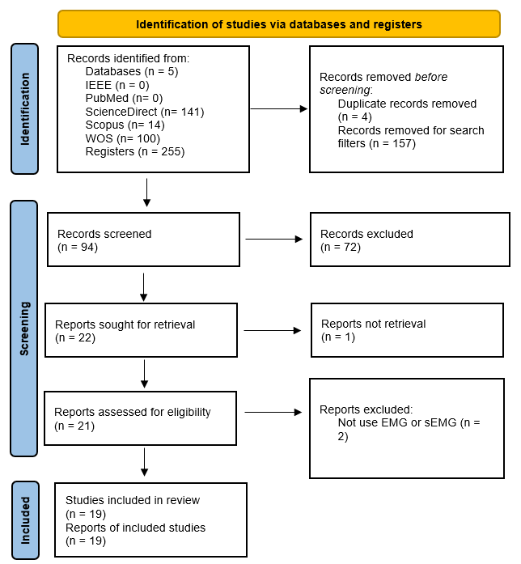
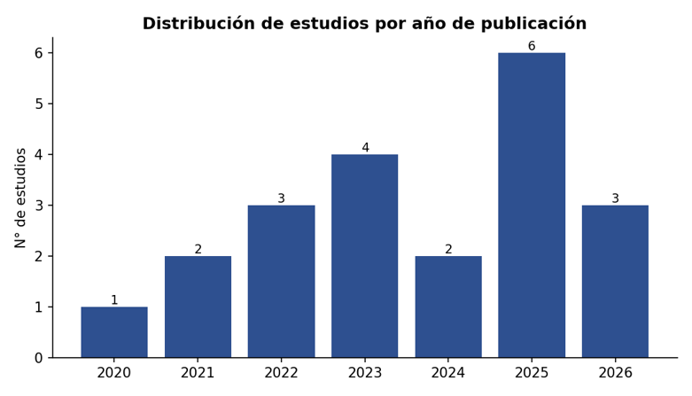
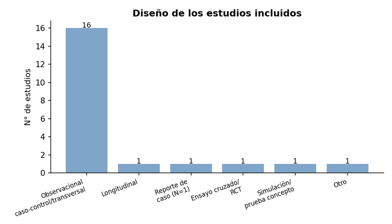
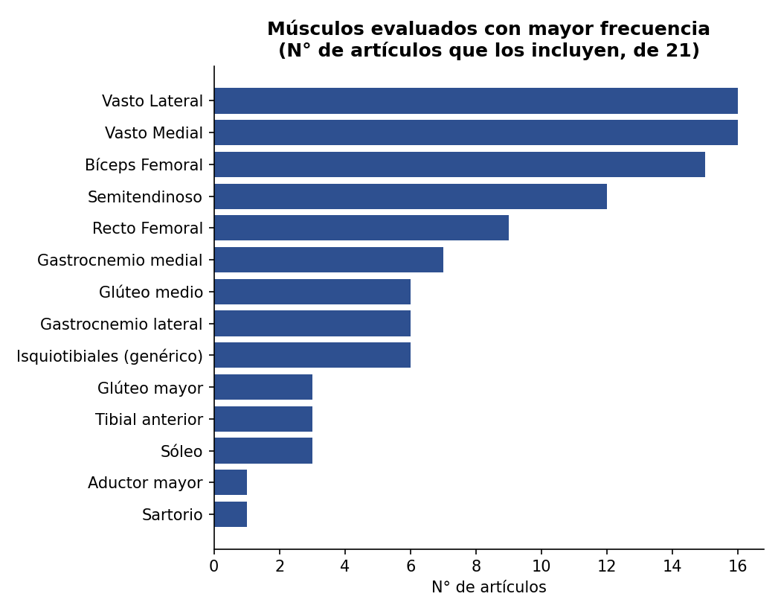
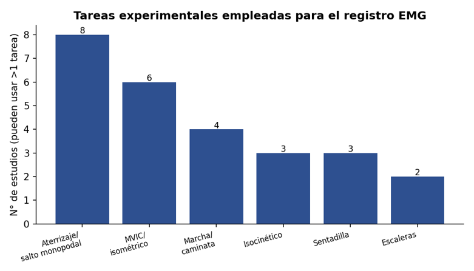
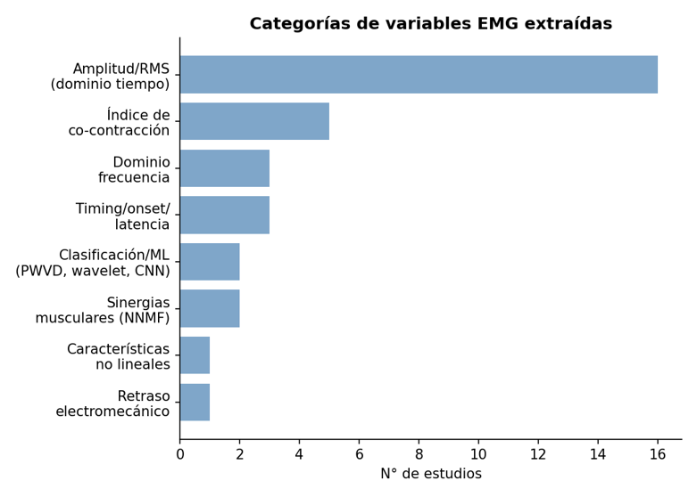

# Actividad electromiografía (EMG) en la lesión y reconstrucción del
# ligamento cruzado anterior (LCA/ACLR): Una revisión sistemática

Profesor: Cristian Morales
Ayudante: Aleli Galaz

Integrantes:

> [<u>Jaime Aninir Brickell</u>](mailto:jaime.aninir [at] usach.cl)
>
> [<u>Fabian Marchant Vidal</u>](mailto:fabian.marchant [at] usach.cl)

**Resumen:** La reconstrucción del ligamento cruzado anterior (LCA/ACLR)
es una de las cirugías ortopédicas más frecuentes en deportistas, pero
incluso tras un retorno deportivo exitoso persisten déficits de control
neuromuscular difíciles de cuantificar con la evaluación clínica
estándar. La electromiografía de superficie (sEMG) permite objetivar
estos déficits de forma no invasiva. Este trabajo sintetiza 21 estudios:
19 de una revisión sistemática exploratoria (2020--2026) y 2 estudios
adicionales incorporados para contrastar y ampliar los hallazgos. Se
analizan de forma narrativa y cuantitativa las tendencias por dominio
(temporal, frecuencial, sinergias, co-contracción/EMD, clasificación
automática y estudios longitudinales), identificando concordancias,
discrepancias y proporción de estudios que respaldan cada tendencia. La
evidencia es consistente en mostrar déficits de activación y asimetrías
persistentes del complejo isquiotibial-cuádriceps incluso años después
del retorno al deporte (9 de 10 estudios del dominio temporal), pero
heterogénea en protocolos de procesamiento, tareas y variables
extraídas, lo que impide un metaanálisis cuantitativo y sustenta la
necesidad de una metodología estandarizada de procesamiento sEMG.

**Palabras clave:** electromiografía de superficie, ligamento cruzado
anterior, reconstrucción de LCA, control neuromuscular, procesamiento de
señales, tareas experimentales, síntesis narrativa

# Introducción

La lesión del ligamento cruzado anterior (LCA) es una de las lesiones
musculoesqueléticas más frecuentes e incapacitantes en el ámbito
deportivo, y afecta predominantemente a atletas, población joven y
físicamente activa \[1\]. Su incidencia varía considerablemente según el
deporte, el sexo y el nivel competitivo, siendo especialmente elevada en
disciplinas que involucran cambios de dirección, desaceleración y
aterrizajes, como el fútbol, el baloncesto y el balonmano \[2\]. Incluso
tras un proceso de rehabilitación o reconstrucción, el retorno a la
actividad es incierto, ya que provoca déficits en la estabilidad
articular y control neuromuscular \[3\]. Lo que ha impulsado un interés
creciente por comprender los mecanismos neuromusculares no evidentes al
riesgo de lesión y re-lesión \[2\].

En este escenario, la electromiografía de superficie (sEMG) se ha
consolidado como una herramienta central para evaluar de forma no
invasiva la actividad eléctrica muscular en pacientes con lesión o
reconstrucción del LCA. A través de variables derivadas de la señal EMG
(amplitud, timing, co-contracción, retraso electromecánico, entre
otras). Además, presenta una alternativa más económica a diferencia de
tecnologías más costosas y complejas, como la resonancia magnética
funcional, la captura de movimiento 3D o los dinamómetros isocinéticos
\[4\], por lo tanto, la sEMG ofrece ventajas notables: es no invasiva,
portátil, de bajo costo y adaptable a entornos clínicos y deportivos, lo
que la convierte en una alternativa accesible para el seguimiento
longitudinal de pacientes.

Además, los avances recientes en procesamiento de señales han ampliado
el potencial de la sEMG. El uso de análisis tiempo-frecuencia, sinergias
musculares y algoritmos de aprendizaje automático permite identificar
patrones neuromusculares sutiles que no son detectados por métodos
convencionales \[4,5\]. Estas innovaciones posicionan a la sEMG no solo
como una herramienta diagnóstica, sino también como un biomarcador
económico e inteligente para guiar protocolos de rehabilitación
personalizados y evaluar la preparación para el retorno al deporte.

Por lo anterior, el objetivo de la presente revisión sistemática es
sintetizar y analizar críticamente la evidencia científica publicada
entre 2020 y 2026 sobre la actividad electromiográfica en pacientes con
lesión y/o reconstrucción del LCA, describiendo las características
metodológicas de adquisición y procesamiento de la señal EMG, las
variables extraídas y los principales hallazgos funcionales reportados,
con el fin de identificar patrones convergentes, vacíos de conocimiento
y limitaciones metodológicas que orienten la investigación futura en
este campo.

# Metodología

La presente revisión sigue las directrices de la guía PRISMA para
revisiones sistemáticas \[6\]. Se consultaron las siguientes bases de
datos: IEEE Xplore Digital Library; National Library of Medicine,
National Center for Biotechnology Information (NIH),
[**Pubmed.gov**](http://pubmed.gov/); ScienceDirect (Elsevier); Scopus
(Elsevier) y Web of Science (WOS).

El 18 de julio de 2026 se evaluó una estrategia de búsqueda utilizando
el comando:

**(EMG OR electromyography) AND (ACL OR "anterior cruciate ligament")
AND (rehabilitation OR postoperative OR "post-operative") AND ("signal
processing" OR "signal analysis")**

La búsqueda inicial identificó un total de 255 registros en las bases de
datos consultadas, de los cuales solo fueron seleccionados un total de
98 registros donde se aplicaron filtros para limitar los resultados a
artículos científicos publicados desde 2020, escritos en inglés.

Para evitar sesgos en la selección y el análisis de los estudios, el
proceso de gestión de referencias y detección de registros duplicados se
realizó mediante Rayyan, identificándose cuatro registros duplicados. La
evaluación de títulos y resúmenes (screening) fue realizada de manera
independiente y cegada por ambos autores, y las discrepancias fueron
resueltas mediante discusión y consenso entre ambos autores. Durante
esta selección, se consideraron los estudios científicos cuyos títulos
contenían las palabras clave:

**Criterios de inclusión:**

- Estudios realizados en seres humanos.

- Participantes con antecedente de lesión del ligamento cruzado anterior
  (LCA).

- Estudios que evaluarán la actividad muscular mediante electromiografía
  (EMG)

- Estudios relacionados con la evaluación funcional, tratamiento,
  rehabilitación o retorno al deporte posterior a la lesión/tratamiento
  del LCA.

- Estudios que reportaran variables derivadas de señales EMG.

**Criterios de exclusión:**

- Revisiones sistemáticas o narrativas; metaanálisis;

- Estudios en animales; in vitro;

- Estudios que no utilizaran EMG;

- Estudios que no involucraran pacientes con lesión de LCA;

- Artículos de conferencia, editoriales, cartas al editor, protocolos,
  tesis, etc.;

Además, se adicionaron dos artículos más a los resultados finales de la
metodología, dado que cumplen los criterios anteriores y sus diseños
experimentales y tamaño muestral son de interés.

Finalmente, la extracción de información de los artículos seleccionados
fue realizada por ambos autores del estudio, donde los datos fueron
registrados y almacenados en un formulario de registro creado con Google
Sheets (Google LLC), donde se consideraron los siguientes datos:

- Autores.

- Año de publicación;

- País.

- Tipo de estudio.

- Tamaño de muestra, características demográficas de los participantes
  (edad y sexo) y distribución por grupos.

- Estado del LCA (lesionado, reconstruido, postoperatorio, etc.).

- Tipo de lesión.

- Tipo de tratamiento.

- Tiempo transcurrido desde la lesión, reconstrucción del LCA o
  finalización del tratamiento, según correspondiera.

- Protocolo de rehabilitación.

- Retorno al deporte.

- Músculos estudiados.

- Características de adquisición de la señal EMG.

- Tarea experimental.

- Procesamiento de la señal EMG.

- Variables EMG extraídas.

- Principales resultados.

# Resultados

De la búsqueda inicial en las distintas bases de datos, se obtuvieron
255 estudios, de los cuales 157 fueron descartados por filtros de
búsqueda y 4 por ser duplicados , quedando un total de 94. Durante la
fase de selección de títulos y resúmenes, se excluyeron 72 artículos, y
21 pasaron a la fase de revisión ampliada para determinar su
elegibilidad, quedando 1 estudio descartado por falta de accesibilidad.
Finalmente, se excluyeron 2 estudios en la fase de extracción de
información, y se seleccionaron 20 para su análisis y discusión. El
proceso de selección se detalla en el diagrama PRISMA de la figura 1.

Figura 1: Diagrama de flujo PRISMA 2020 para revisión sistemática.

En el anexo Tabla I, puede ver la información principal de cada artículo
incluido.

## 1. Panorama general de los estudios incluidos

El conjunto de 21 estudios abarca publicaciones entre 2020 y 2026
(incluyendo 3 artículos aceptados/publicados en 2026), con una marcada
concentración en los últimos tres años: 11 de los 21 estudios (52%)
fueron publicados entre 2024 y 2026, lo que refleja un campo de
investigación activo y en expansión, impulsado en parte por el auge de
técnicas de procesamiento avanzado de señal (deep learning, wavelets,
sinergias musculares).

*Figura 2. Distribución de los estudios incluidos según año de
publicación (N=21).*

En cuanto al origen geográfico, China concentra la mayor cantidad de
estudios (5 de 21), seguido de Irán, España y Francia (2 estudios cada
uno, algunos en colaboración internacional). El resto de los países
—Canadá, Japón, Rusia, Italia, Suiza/Alemania/Bélgica, Indonesia, India,
Egipto, Estados Unidos y Polonia— aportan un estudio cada uno. Esta
dispersión geográfica amplia, sin un centro dominante de investigación,
sugiere que el interés por la EMG en ACLR es un fenómeno global más que
la línea de trabajo de un grupo o región específica.

Respecto al diseño metodológico, predominan ampliamente los estudios
observacionales de tipo caso-control o transversal comparativo (16 de 21
estudios, 76%), que comparan típicamente un grupo con LCA
lesionado/reconstruido frente a un grupo control sano o frente a la
pierna contralateral del mismo sujeto. El resto del conjunto es
heterogéneo: 1 estudio longitudinal con seguimiento a 12 meses, 1
reporte de caso único (N=1), 1 ensayo cruzado aleatorizado (RCT), 1
estudio de simulación/prueba de concepto orientado a exoesqueletos, y 1
estudio clasificado como diseño mixto. Esta prevalencia de diseños
transversales limita las conclusiones sobre trayectorias de
recuperación, y contrasta con la necesidad —señalada explícitamente por
varios autores— de más estudios longitudinales que permitan establecer
si las alteraciones neuromusculares observadas son transitorias o
persistentes.

*Figura 3. Diseño metodológico de los estudios incluidos (N=21).*

## 2. Características de la población y estado del LCA

Los tamaños muestrales son, en general, pequeños: la mayoría de los
estudios trabaja con grupos de entre 10 y 30 participantes por brazo
(frecuentemente entre n=10 y n=15 en el grupo ACLR), con extremos que
van desde el reporte de caso único (N=1, Soma et al. 2022) hasta el
estudio con mayor muestra (N=61, Saranya & Arunthathi, que reanaliza un
dataset público). Varios estudios recientes también reutilizan datasets
públicos preexistentes en lugar de recolectar datos propios (artículos
17 y 18), una tendencia emergente que permite ampliar el N sin nuevas
recolecciones, aunque limita el control sobre variables de interés no
registradas originalmente.

En cuanto al sexo, predominan las muestras exclusivamente masculinas o
de mayoría masculina (artículos 1, 3, 8, 11, 15), aunque varios estudios
recientes —especialmente los orientados a fútbol o balonmano femenino—
incluyen muestras exclusivamente femeninas (artículo 2) o mixtas
equilibradas (artículos 4, 6, 10, 13, 17). Esta heterogeneidad en la
composición por sexo, sumada al tamaño muestral reducido, limita la
generalización de los hallazgos y la posibilidad de análisis de
subgrupos por sexo.

El estado del LCA y el tiempo transcurrido desde la lesión/cirugía
varían enormemente entre estudios, cubriendo prácticamente todo el
espectro temporal de la condición:

- **Fase aguda / pre-quirúrgica:** artículos 10 y 12 evalúan pacientes
  con LCA roto aún no reconstruido (7-21 días post-lesión en el artículo
  12; \>6 meses de espera en el artículo 10).

- **Postoperatorio temprano (semanas a pocos meses):** artículos 7, 8 y
  13 (17-29 semanas o 4 meses post-cirugía).

- **Postoperatorio intermedio (6 meses a 2 años, en torno al retorno al
  deporte):** artículos 2, 3, 5, 11, 14, 16, 'adicional 1', que suelen
  coincidir con la ventana clínica de retorno al deporte.

- **Postoperatorio tardío/largo plazo (\>2 años, hasta 10-15 años):**
  artículos 4 (1-3 años), 6 (promedio 10,6 años), 9 (promedio 3,4 años),
  17 (3-12 años), 19 (10-15 años) y 'adicional 2' (2-3 años).

Este amplio rango temporal es clave para la síntesis de resultados
(sección 9): permite observar que las alteraciones neuromusculares no se
limitan a la fase aguda de recuperación, sino que en varios estudios
persisten años —incluso más de una década— después de la cirugía, a
pesar de que los pacientes hayan retornado clínicamente al deporte.

**Tratamiento y tipo de lesión**

La gran mayoría de los estudios (18 de 21) evalúa pacientes con
reconstrucción quirúrgica del LCA (ACLR), utilizando distintos tipos de
injerto: autoinjerto de tendones isquiotibiales (semitendinoso/gracilis)
es el más frecuente (artículos 2, 3, 7, 11, 19, 'adicional'), seguido de
injerto hueso-tendón rotuliano-hueso/BPTB (artículos 6, 14, 19) e
injertos artificiales tipo LARS (artículo 8, mayoritario). Un subgrupo
de estudios evalúa pacientes en la fase de lesión sin reconstruir
(artículos 1 —grupo mixto—, 10 y 12), lo que permite contrastar el
efecto de la deficiencia ligamentaria frente al de la cirugía y la
rehabilitación posterior.

El protocolo de rehabilitación es, en general, pobremente descrito: la
mayoría de los artículos menciona genéricamente que los participantes
completaron un programa de rehabilitación 'estándar' o 'supervisado' sin
detallar su contenido, duración o adherencia (p. ej., artículos 1, 4, 5,
9, 15, 18). Solo un número reducido de estudios reporta protocolos
estructurados con fases y semanas específicas (artículos 6 —22 semanas—,
11 —protocolo de Beynnon et al., 6-9 meses—, 13 —3 meses de
entrenamiento progresivo— y 'adicional 1' —programa de 3 fases en 24+
semanas—). Esta falta de estandarización y de reporte detallado de la
rehabilitación constituye una limitación transversal importante para
comparar resultados entre estudios, ya que el contenido y la calidad de
la rehabilitación pueden modular directamente los patrones EMG
observados.

El retorno al deporte (RTS) se reporta de forma inconsistente: algunos
estudios lo confirman como criterio de inclusión con pruebas objetivas
(fuerza isocinética ≥90% de simetría, tests de salto, preparación
psicológica: artículo 'adicional 1'), otros lo mencionan de forma
cualitativa (p. ej., 'todas las jugadoras estaban compitiendo
activamente': artículo 2), y varios estudios simplemente no lo evalúan
por corresponder a fases prequirúrgicas o muy tempranas postcirugía
(artículos 8, 10, 12, 15, 18). Esta inconsistencia dificulta relacionar
directamente los hallazgos EMG con el éxito funcional del RTS.

## 3. Músculos evaluados

Existe una fuerte convergencia en la selección muscular: prácticamente
todos los estudios se centran en la musculatura del muslo,
particularmente el cuádriceps (vasto medial y vasto lateral, presentes
en 16 de 21 estudios cada uno) y los isquiotibiales (bíceps femoral en
15 estudios, semitendinoso en 12), reflejando el rol central de este par
agonista-antagonista en la estabilidad anteroposterior de la rodilla y
en la protección del injerto de LCA. El recto femoral aparece en 9
estudios. Un subgrupo de estudios amplía el análisis a musculatura de
cadera y tobillo —glúteo medio y mayor (6 y 3 estudios respectivamente),
gastrocnemios medial/lateral (7 y 6 estudios) y sóleo/tibial anterior (3
estudios cada uno)— generalmente en el contexto de tareas dinámicas
complejas como aterrizajes, marcha o descenso de escaleras, donde la
coordinación proximal-distal cobra mayor relevancia.

*Figura 4. Frecuencia con que cada músculo fue evaluado a través de los
21 estudios.*

Esta concentración en cuádriceps e isquiotibiales, si bien coherente con
la fisiopatología del LCA, deja relativamente sub-representada la
musculatura de cadera (glútea) y de tobillo en el conjunto de la
literatura, pese a la evidencia —presente en varios de los estudios
incluidos (2, 5, 6, 'adicional 1')— de que las estrategias
compensatorias proximales (glúteas) y distales pueden ser tan relevantes
como el propio cuádriceps/isquiotibiales para explicar el riesgo de
re-lesión.

## 4. Características de adquisición de la señal EMG

La totalidad de los estudios emplea electromiografía de superficie
(sEMG) no invasiva, con electrodos Ag/AgCl colocados siguiendo las guías
SENIAM (Surface Electromyography for the Non-Invasive Assessment of
Muscles) como estándar casi universal de posicionamiento. Los sistemas
de adquisición utilizados son diversos e incluyen equipos comerciales
especializados: Noraxon (Desktop DTS, Ultium, sistema inalámbrico
genérico) es el más citado (artículos 5, 9, 12, 16, 19), seguido de
Delsys (Trigno Avanti/Wireless System: artículos 2, 6, 13) y ME6000 de
Megawin/MEGA Electronics (artículos 1, 3, 14). Un subgrupo de estudios
más orientados a ingeniería biomédica desarrolla sistemas propios o de
bajo costo (sensor iFEMG multicapa desarrollado por los autores en el
artículo 8; electrodo Myoware de bajo costo en el artículo 15).

Las frecuencias de muestreo declaradas oscilan entre 1000 y 4000 Hz, con
2000 Hz como valor más frecuente (utilizado en al menos 8 de los
estudios que reportan este dato explícitamente), lo cual es coherente
con las recomendaciones estándar para sEMG de superficie en
investigación biomecánica. La normalización de la señal —necesaria para
comparar amplitud entre sujetos y grupos— se realiza mayoritariamente
respecto a la contracción isométrica voluntaria máxima (MVIC/MVC),
presente en la mayoría de los estudios que reportan amplitud, aunque con
variantes metodológicas relevantes: el artículo 6 normaliza
explícitamente al valor EMG máximo registrado durante cada ensayo
(normalización intra-tarea) en lugar de MVIC, argumentando mayor
representatividad neural específica de la tarea; y varios estudios de
reanálisis de datasets públicos (17, 18) no detallan completamente el
procedimiento de normalización original.

Esta heterogeneidad en sistemas, frecuencias de muestreo y —sobre todo—
métodos de normalización constituye una fuente relevante de variabilidad
entre estudios, que dificulta la comparación directa de valores de
amplitud EMG entre artículos y respalda la necesidad de meta - análisis
cualitativos por sobre la agregación cuantitativa directa de resultados.

## 5. Tareas experimentales

Las tareas de aterrizaje o salto monopodal (single-leg landing/jump,
side-hop, salto horizontal) son las más frecuentemente utilizadas para
provocar y registrar la actividad EMG de interés (8 de 21 estudios), lo
cual es consistente con su relevancia como mecanismo de lesión y
re-lesión del LCA (alta demanda excéntrica, valgo dinámico de rodilla).
Le siguen las contracciones isométricas voluntarias máximas o submáximas
(MVIC, 6 estudios), la marcha o caminata en cinta (4 estudios), las
pruebas isocinéticas en dinamómetro (3 estudios), la sentadilla —uni o
bipodal— (3 estudios) y el descenso de escaleras (2 estudios).

*Figura 5. Tareas experimentales empleadas para el registro EMG (un
estudio puede emplear más de una tarea).*

Esta diversidad de tareas —desde condiciones estáticas/controladas
(MVIC, isocinético) hasta tareas dinámicas de alta demanda (aterrizajes,
escaleras)— es relevante porque varios autores señalan explícitamente
que los déficits neuromusculares del ACLR pueden no manifestarse en
condiciones simples o unilaterales, y solo emergen bajo condiciones de
mayor exigencia funcional o bilateral (ver síntesis de resultados,
sección 8). Esto sugiere que la selección de la tarea experimental
condiciona fuertemente la sensibilidad de la evaluación EMG para
detectar déficits residuales.

## 6. Procesamiento de la señal EMG

El procesamiento de la señal EMG sigue una cadena general relativamente
homogénea en el corpus: señal cruda → filtrado pasa-banda →
rectificación de onda completa → obtención de la envolvente o RMS →
normalización. Esta secuencia está presente en 18 de los 21 estudios.
Sin embargo, los parámetros específicos no están estandarizados: la
banda de filtrado se reporta explícitamente en 14 estudios y varía desde
7–700 Hz hasta 50–500 Hz, sin que dos trabajos coincidan exactamente en
la combinación de banda y orden del filtro. La normalización
predominante es respecto a MVIC/MVC (12/21; 57 %), pero coexiste con
normalización al pico intra-tarea, con una condición de marcha a
velocidad estándar como referencia y con un método de RMS verdadero sin
normalización adicional. Por ello, existe consenso en la cadena general
de procesamiento, pero una heterogeneidad importante en sus parámetros
finos, lo que dificulta comparar directamente las magnitudes de
activación entre estudios.

**a) Análisis de amplitud/timing convencional**

El análisis temporal basado en amplitud/RMS constituye el enfoque más
extendido. Diez estudios lo utilizan como dominio principal o
complementario, mediante variables como RMS, amplitud o valor pico,
porcentaje de MVIC, onset, tiempo al pico y duración de la activación.
Nueve de esos diez estudios reportan al menos una diferencia
significativa o una tendencia clara entre la extremidad o grupo afectado
y el sano. En siete se observa menor amplitud o torque en al menos un
músculo del lado afectado, mientras que tres describen mayor activación
en determinados músculos, compatible con patrones compensatorios. Esto
muestra que la interpretación de la amplitud no es unidireccional y
depende del músculo, de la tarea experimental y del momento
postquirúrgico evaluado.

**b) Modelos biomecánicos derivados: co-contracción y retraso
electromecánico**

Un segundo nivel de procesamiento calcula índices derivados con
interpretación biomecánica, especialmente co-contracción/coactivación y
retraso electromecánico (EMD). Siete estudios reportan alguna variante
de estas métricas, pero emplean fórmulas diferentes —Rudolph, Knarr,
Falconer-Winter, CAI y otras variantes—, de modo que las magnitudes
obtenidas no pueden compararse directamente entre todos los trabajos.
Cinco de los siete estudios encuentran diferencias significativas. En el
caso del EMD, Morris et al. observaron un retraso mayor en el bíceps
femoral, mientras que la co-contracción mostró una sensibilidad
dependiente de la tarea: las diferencias aparecen con mayor frecuencia
en condiciones de alta demanda, como salto, ejecución bilateral o
fatiga, y pueden no manifestarse durante marcha estable.

**c) Técnicas avanzadas de procesamiento de señal y aprendizaje
automático**

En el dominio frecuencial y tiempo-frecuencia, cuatro estudios analizan
características que no se reducen a la amplitud instantánea. Se emplean
frecuencia fundamental, frecuencia mediana, distribución Pseudo
Wigner-Ville (PWVD) y análisis mediante wavelets. Los cuatro trabajos
describen diferencias espectrales o tiempo-frecuenciales entre grupos,
especialmente en isquiotibiales. Hatamzadeh et al. reportan alteraciones
de la PWVD y de la frecuencia fundamental o mediana, mientras que
Zandiyeh et al. identifican mediante wavelets un patrón de intensidad
con valores de cuádriceps 25–50 % mayores y de bíceps femoral hasta 66 %
menores en ACLR, incluso 10–15 años después de la cirugía. En esa misma
muestra, variables discretas clásicas como onset y co-contracción no
habían detectado diferencias, lo que sugiere que el análisis
tiempo-frecuencia podría revelar déficits residuales más sutiles; este
hallazgo, no obstante, proviene de un único estudio y no ha sido
replicado dentro del corpus.

Otra línea avanzada corresponde al análisis multicanal mediante
factorización de matrices no negativas (NNMF) para identificar sinergias
o módulos musculares. Solo dos estudios aplican este enfoque. Ambos
señalan que el número o la estructura global de las sinergias se
mantiene relativamente preservado después de la ACLR, mientras que las
alteraciones aparecen como cambios en la ponderación relativa de los
músculos dentro de sinergias existentes. En el estudio longitudinal de
Wei et al., la dominancia compensatoria del cuádriceps observada a los
3–6 meses se normaliza progresivamente hacia los 12 meses.

Finalmente, tres estudios utilizan el procesamiento de la señal como
entrada para clasificación automática. Hatamzadeh et al. aplican una
DCNN sobre mapas PWVD y reportan 95,8 % de precisión, frente a 79,1 % de
un autoencoder con selección manual; Jafari et al. emplean una DCNN
sobre representaciones PWVD y alcanzan 90,2 %; y Zandiyeh et al. aplican
k-NN sobre características obtenidas con wavelets, con rendimientos
entre 63,5 % y 87,3 % según el músculo. Estos resultados muestran el
potencial de las representaciones tiempo-frecuencia para generar
biomarcadores discriminativos, aunque su generalización es limitada
porque los modelos se entrenan principalmente con cohortes pequeñas y
datos de un único laboratorio.

En conjunto, el corpus muestra una progresión metodológica desde el
procesamiento temporal convencional —RMS, amplitud y timing— hacia
representaciones frecuenciales/tiempo-frecuencia, índices de
coordinación neuromuscular, sinergias multimusculares y modelos de
clasificación. La principal limitación transversal no es la ausencia de
herramientas de procesamiento, sino la falta de estandarización de los
filtros, la normalización y las métricas derivadas, lo que reduce la
comparabilidad entre estudios y dificulta trasladar estos métodos a un
protocolo clínico común.

## 7. Variables EMG extraídas

Consistente con lo descrito en la sección anterior, las variables de
amplitud/RMS son, por amplio margen, las más utilizadas (16 de 21
estudios las incluyen de alguna forma), seguidas de los índices de
co-contracción/coactivación (5 estudios), variables de timing/onset (3),
variables en el dominio de la frecuencia —frecuencia mediana o
fundamental— (3), coeficientes de sinergias musculares vía NNMF (2) y
variables derivadas de clasificación/aprendizaje automático sobre
representaciones tiempo-frecuencia (2). El retraso electromecánico y las
características no lineales de complejidad de la señal (entropía
muestral, dimensión de correlación, kurtosis, skewness) aparecen cada
una en un único estudio, pero representan enfoques metodológicamente
novedosos con potencial discriminativo reportado como superior al de las
variables de amplitud simple en el estudio que las emplea (artículo
17).

*Figura 6. Categorías de variables EMG extraídas por los estudios
incluidos (categorías no excluyentes).*

## 8. Síntesis de resultados: patrones convergentes en la literatura

Pese a la heterogeneidad metodológica descrita en las secciones
anteriores, al comparar los resultados reportados por los 21 estudios,
emergen varios patrones recurrentes que constituyen, en conjunto, el
estado del arte actual sobre la actividad EMG en la lesión y
reconstrucción del LCA.

**8.1 Inhibición/menor activación muscular en la extremidad afectada**

El hallazgo más consistente a través de los estudios es una menor
amplitud o activación EMG en la extremidad con LCA
lesionado/reconstruido respecto a la extremidad sana o al grupo control,
particularmente en cuádriceps: menor amplitud EMG máxima en TA,
gastrocnemio, cuádriceps e isquiotibiales durante la marcha (artículo
9); menor RMS pico de vasto lateral, vasto medial y glúteo medio en la
pierna afectada durante aterrizaje monopodal (artículo 10); menor
actividad de isquiotibiales (33-51%) y vasto lateral (~40%) en descenso
de escaleras en la fase aguda pre-quirúrgica (artículo 12); y menor
activación de glúteo medio durante sentadilla monopodal (artículo
'adicional 1'). Este patrón de inhibición del cuádriceps ('arthrogenic
muscle inhibition') es consistente con la literatura clásica sobre
disfunción neuromuscular post-lesión articular de rodilla.

**8.2 Hiperactivación compensatoria de isquiotibiales y musculatura
proximal**

En paralelo a la inhibición del cuádriceps, múltiples estudios
documentan una hiperactivación compensatoria del semitendinoso (ST) y/o
del bíceps femoral (BF), y en algunos casos del glúteo mayor, en tareas
de riesgo para el LCA: mayor actividad de ST en fase de contacto inicial
y fase de riesgo durante salto lateral (artículo 6); mayor RMS pico y
promedio de ST y activación más temprana/prolongada de BF y glúteo mayor
durante aterrizaje monopodal (artículo 10); mayor coeficiente de
amortiguamiento/rigidez en isquiotibiales laterales post-fatiga
(artículo 3); y mayor traslación tibial con mayor actividad de
isquiotibiales (2,2 a 4,6 veces) durante perturbación de traslación
tibial en fase aguda (artículo 12). Esta combinación de inhibición de
cuádriceps + hiperactivación de isquiotibiales/glúteos se interpreta de
forma consistente en varios artículos como una estrategia protectora
compensatoria del sistema neuromuscular frente a la deficiencia
ligamentaria.

**8.3 Persistencia de alteraciones neuromusculares a largo plazo, pese
al retorno al deporte**

Uno de los hallazgos más relevantes para la práctica clínica es que
varios estudios con seguimientos largos (\>1 año, hasta 10-15 años
post-cirugía) documentan alteraciones EMG persistentes pese a que los
pacientes hayan retornado exitosamente al deporte: mayor retraso
electromecánico del bíceps femoral en la pierna ACLR a 1-3 años
post-cirugía, en atletas ya retornados a competición sin restricciones
(artículo 4); mayor activación de ST y mayor co-contracción
cuádriceps:isquiotibiales en side-hop incluso ~10 años post-cirugía en
promedio (artículo 6); menor entropía muestral en isquiotibiales
mediales a 3-12 años post-cirugía, interpretada como pérdida de
variabilidad adaptativa (artículo 17); y patrones de intensidad EMG
alterados —aumento de 25-50% en intensidad relativa del cuádriceps y
disminución de 66% en bíceps femoral— a 10-15 años de seguimiento
(artículo 19). En conjunto, estos hallazgos cuestionan la suficiencia de
los criterios clínicos actuales de retorno al deporte (habitualmente
basados en fuerza y tests de salto a los 6-9 meses) para garantizar una
recuperación neuromuscular completa, y sugieren que las adaptaciones
compensatorias pueden convertirse en un patrón de movimiento estable a
largo plazo más que en un déficit transitorio.

**8.4 Trayectoria de recuperación: normalización progresiva en el primer
año**

En contraste parcial con el punto anterior, el único estudio
longitudinal del conjunto (artículo 5, seguimiento a 3, 6, 9 y 12 meses)
muestra que los patrones de sinergias musculares compensatorias
(dominancia de cuádriceps) presentes a los 3-6 meses post-cirugía se
normalizan progresivamente hacia los 9 meses y se restauran casi
completamente a los 12 meses, en paralelo con la mejora de las
puntuaciones funcionales KOOS. Esto sugiere que, al menos para algunas
variables (particularmente estructura de sinergias musculares en tareas
moderadas como el descenso de escaleras), existe una ventana de
recuperación neuromuscular más favorable durante el primer año, mientras
que otras variables (retraso electromecánico, co-contracción en tareas
de alta demanda) podrían representar déficits más resistentes al tiempo
y a la rehabilitación estándar. La aparente contradicción entre estudios
con seguimientos cortos que muestran normalización y estudios con
seguimientos largos que muestran persistencia podría explicarse por
diferencias en la variable EMG analizada, la tarea experimental
utilizada (mayor o menor demanda neuromuscular) y el tipo de análisis
(sinergias vs. amplitud simple vs. timing).

**8.5 Las asimetrías se manifiestan preferentemente en condiciones de
alta demanda**

Varios estudios coinciden en que los déficits neuromusculares no siempre
son evidentes en condiciones simples, y se hacen aparentes solo bajo
condiciones más exigentes: las asimetrías EMG y de co-contracción entre
pierna operada y no operada se manifestaron únicamente durante ejecución
bilateral de MVIC, no durante ejecución unilateral (artículo 11); la
simetría de activación del vasto lateral empeoró notablemente al
aumentar la velocidad angular del movimiento isocinético (artículo 18);
y el índice de amortiguamiento de isquiotibiales solo mostró diferencias
significativas entre grupos tras un protocolo de fatiga (artículo 3).
Este patrón sugiere que las evaluaciones clínicas y de investigación
centradas exclusivamente en tareas unilaterales, de baja velocidad o sin
fatiga podrían subestimar sistemáticamente los déficits neuromusculares
reales tras la ACLR.

**8.6 Aplicaciones tecnológicas emergentes: clasificación automática y
biofeedback**

Un subconjunto de estudios más recientes explora aplicaciones
traslacionales de la señal EMG más allá de la caracterización
descriptiva: modelos de deep learning (DCNN sobre representaciones PWVD)
capaces de clasificar el estado de salud del LCA con precisiones de
90-96% (artículos 1 y 14), potencialmente útiles como herramienta de
apoyo a la decisión de retorno al deporte; un sistema de exoesqueleto
robótico (HAL) guiado por biofeedback EMG que redujo la co-contracción
excesiva y mejoró el torque muscular en un caso clínico (artículo 7); un
sistema combinado de electroestimulación neuromuscular (NMES) que
modificó favorablemente los patrones de sinergias musculares durante el
salto en un ensayo cruzado aleatorizado con artistas marciales (artículo
13); y un sensor de bajo costo (iFEMG, que combina sEMG con miografía de
fuerza) capaz de detectar patrones de hiperactivación e hipertrofia
asimétrica no evidentes con análisis de carga única (artículo 8). Estas
líneas emergentes apuntan hacia la EMG no solo como herramienta
diagnóstica/descriptiva, sino como insumo activo para sistemas de
biofeedback, entrenamiento asistido y toma de decisiones clínicas
automatizada.

**8.7 Hallazgos discordantes o específicos de contexto**

No todos los estudios son concordantes. Por ejemplo, el artículo 4 no
logró replicar el mayor retraso electromecánico del semitendinoso
reportado por estudios previos (Ristanis et al., Freddolini et al.),
atribuyéndolo a una pobre regeneración anatómica del tendón donante
observada por ecografía; el artículo 9 mostró que, a velocidad rápida de
marcha, la diferencia entre pacientes y controles sanos desaparecía
(mientras que a velocidad voluntaria sí era significativa), en un patrón
opuesto al esperado; y el artículo 17 encontró que la kurtosis y el
índice de coactivación no diferenciaron a los grupos, mientras que otras
características de orden superior (dimensión de correlación, entropía
muestral, skewness) sí lo hicieron, mostrando que no todas las variables
EMG tienen igual sensibilidad para detectar diferencias entre grupos.
Estas discrepancias subrayan que los hallazgos EMG en ACLR dependen
fuertemente de la variable específica analizada, la tarea experimental y
las características de la muestra (tiempo post-cirugía, tipo de injerto,
nivel deportivo), y no deben generalizarse sin considerar estos factores
contextuales.

**9. Vacíos de conocimiento y limitaciones metodológicas del conjunto de
la literatura**

A partir de la comparación transversal de los 21 estudios, se
identifican las siguientes limitaciones y vacíos recurrentes:

- Heterogeneidad en la normalización de la señal EMG: el uso de MVIC vs.
  normalización intra-tarea vs. ausencia de normalización dificulta la
  comparación cuantitativa directa de amplitudes entre estudios.

- Tamaños muestrales pequeños: la mayoría de los grupos experimentales
  tiene entre 10 y 20 participantes, con un caso N=1, lo que limita la
  potencia estadística y la generalización.

- Escasez de estudios longitudinales: solo 1 de 21 estudios sigue a los
  mismos pacientes en el tiempo; el resto son 'fotografías'
  transversales en distintos momentos post-cirugía, lo que impide
  reconstruir trayectorias individuales de recuperación.

- Reporte insuficiente del protocolo de rehabilitación: la mayoría de
  los artículos no detalla el contenido, dosis ni adherencia a la
  rehabilitación recibida, un factor de confusión relevante para
  interpretar los hallazgos EMG.

- Concentración muscular en cuádriceps/isquiotibiales: la musculatura de
  cadera y tobillo está relativamente sub-representada pese a evidencia
  de su rol compensatorio.

- Predominio de tareas de baja o moderada demanda: pocos estudios
  incorporan condiciones de fatiga, alta velocidad o bilateralidad, pese
  a evidencia de que estas condiciones son más sensibles para detectar
  déficits residuales.

- Falta de estandarización de retorno al deporte como variable: el RTS
  se define y mide de forma inconsistente entre estudios, dificultando
  vincular directamente los hallazgos EMG con el éxito funcional real.

- Composición por sexo desbalanceada o no reportada uniformemente:
  limita el análisis de posibles diferencias sexo-específicas en los
  patrones neuromusculares post-ACLR.

# Conclusiones

La evidencia disponible en los 21 estudios revisados converge en mostrar
que la reconstrucción quirúrgica del LCA, si bien restaura la
estabilidad mecánica de la rodilla, no garantiza por sí sola la
normalización del control neuromuscular: los patrones de inhibición del
cuádriceps y de hiperactivación compensatoria de isquiotibiales y
musculatura glútea aparecen de forma recurrente a través de distintos
diseños, poblaciones, tareas y técnicas de análisis, y en varios
estudios persisten años después de la cirugía y del retorno clínico al
deporte. Al mismo tiempo, el único estudio longitudinal disponible
sugiere que ciertas variables (como la estructura de sinergias
musculares en tareas moderadas) sí tienden a normalizarse dentro del
primer año, lo que indica que la trayectoria de recuperación
neuromuscular es heterogénea según la variable, la tarea y el nivel de
demanda funcional evaluados.

El campo se encuentra en una etapa de transición metodológica, con un
núcleo mayoritario de estudios que aún emplea variables clásicas de
amplitud EMG (RMS, %MVIC) y un subconjunto creciente —concentrado en
publicaciones de 2023 en adelante— que incorpora técnicas de
procesamiento avanzado (sinergias musculares, análisis
tiempo-frecuencia, deep learning) con capacidad prometedora para
identificar biomarcadores más sensibles y específicos que la amplitud
simple. Para consolidar el estado del arte, la literatura futura debería
avanzar hacia diseños longitudinales, protocolos de normalización y
rehabilitación estandarizados y mejor reportados, tareas experimentales
de mayor demanda funcional (fatiga, bilateralidad, alta velocidad), y
una representación más equilibrada de la musculatura proximal y distal
involucrada en la estabilidad dinámica de la rodilla tras la lesión del
LCA.

# Referencias

\[1\] A. M. Montalvo, “Anterior cruciate ligament injury risk in sport:
A systematic review and meta-analysis of injury incidence by sex and
sport classification,” J. Athletic Training, vol. 54, no. 5, pp.
472–482, May 2019, doi:10.4085/1062-6050-407-16

\[2\] R. Paredes et al., “Electromyographic assessment of agonist and
antagonist muscles related to the anterior cruciate ligament following
surgical Reconstruction: A Cross-Sectional study,” Journal of
Electromyography and Kinesiology, vol. 84, p. 103044, Oct. 2025, doi:
10.1016/j.jelekin.2025.103044.

\[3\] Y. Wei et al., “Distinct Motor Modules After Anterior Cruciate
Ligament Reconstruction During Stair Descent: A One-Year Longitudinal
Study,” IEEE Transactions on Neural Systems and Rehabilitation
Engineering, vol. 34, pp. 1734–1745, 2026, doi:
10.1109/tnsre.2026.3674750.

\[4\] M. Hatamzadeh, R. Hassannejad, and A. Sharifnezhad, “A new method
of diagnosing athlete’s anterior cruciate ligament health status using
surface electromyography and deep convolutional neural network,”
Biocybernetics and Biomedical Engineering, vol. 40, no. 1, pp. 65–76,
Jan. 2020, doi: 10.1016/j.bbe.2019.05.009.

\[5\] P. Zandiyeh, L. R. Parola, B. C. Fleming, and J. E. Beveridge,
“Wavelet analysis reveals differential lower limb muscle activity
patterns long after anterior cruciate ligament reconstruction,” Journal
of Biomechanics, vol. 133, p. 110957, Mar. 2022, doi:
10.1016/j.jbiomech.2022.110957.

\[6\] M. J. Page et al., “PRISMA 2020 Explanation and elaboration:
Updated Guidance and Exemplars for Reporting Systematic Reviews,”
British Medical Journal, vol. 372, no. 160, Mar. 2021, doi:
10.1136/bmj.n160.

**Referencias de articulos incluidos en la revisión.**

\[1\] M. Hatamzadeh, R. Hassannejad, and A. Sharifnezhad, “A new method
of diagnosing athlete’s anterior cruciate ligament health status using
surface electromyography and deep convolutional neural network,”
Biocybernetics and Biomedical Engineering, vol. 40, no. 1, pp. 65–76,
Jan. 2020, doi: 10.1016/j.bbe.2019.05.009.

\[2\] L. Ferrández-Laliena et al., “Comparative Analysis of
Neuromuscular Activation Patterns Associated with Force between
Semi-Professional Female Soccer Players with Previous Anterior Cruciate
Ligament Surgery and Healthy Players in Thigh Musculature Related to
Valgus Collapse,” Applied Sciences, vol. 14, no. 16, p. 6869, Aug. 2024,
doi: 10.3390/app14166869.

‌\[3\] M. Hatamzadeh, A. Sharifnezhad, R. Hassannejad, and R. Zory,
“Discriminative sEMG-based features to assess damping ability and
interpret activation patterns in lower-limb muscles of ACLR athletes,”
Biomedical Signal Processing and Control, vol. 83, p. 104665, May 2023,
doi: 10.1016/j.bspc.2023.104665.

‌\[4\] Y. Wei et al., “Distinct Motor Modules After Anterior Cruciate
Ligament Reconstruction During Stair Descent: A One-Year Longitudinal
Study,” IEEE Transactions on Neural Systems and Rehabilitation
Engineering, vol. 34, pp. 1734–1745, 2026, doi:
10.1109/tnsre.2026.3674750.

\[5\] N. Morris, M. J. Jordan, M. Heard, and W. Herzog,
“Electromechanical delay of the hamstrings following semitendinosus
tendon autografts in return to competition athletes,” European Journal
of Applied Physiology, vol. 121, no. 7, pp. 1849–1858, Mar. 2021, doi:
10.1007/s00421-021-04639-y.

‌\[6\] R. Paredes et al., “Electromyographic assessment of agonist and
antagonist muscles related to the anterior cruciate ligament following
surgical Reconstruction: A Cross-Sectional study,” Journal of
Electromyography and Kinesiology, vol. 84, p. 103044, Oct. 2025, doi:
10.1016/j.jelekin.2025.103044.

\[7\] Y. Soma et al., “Electromyographic examination of knee training
using a hybrid assistive limb after anterior cruciate ligament
reconstruction: A case report,” Asia-Pacific Journal of Sports Medicine,
Arthroscopy, Rehabilitation and Technology, vol. 27, pp. 13–18, Jan.
2022, doi: 10.1016/j.asmart.2021.12.002.

\[8\] C. Liu et al., “iFEMG-Based Muscle Function Assessment for
Rehabilitation Monitoring After Knee Anterior Cruciate Ligament Repair
Surgery,” IEEE Transactions on Neural Systems and Rehabilitation
Engineering, vol. 34, pp. 3362–3373, 2026, doi:
10.1109/tnsre.2026.3713028.

\[9\] D. Skvortsov, A. Altukhova, S. Kaurkin, and A. Akhpashev,
“Long-Term Outcomes of Anterior Cruciate Ligament Reconstruction Based
on Gait Analysis,” Diagnostics, vol. 14, no. 17, p. 1977, Sept. 2024,
doi: 10.3390/diagnostics14171977.

‌\[10\] J. Xu, M. Chen, J. Ran, and X. Luo, “Lower extremity
electromyographic characteristics of patients with noncontact anterior
cruciate ligament rupture in one-legged jump landings: a case-control
study,” Scientific Reports, vol. 15, no. 1, Nov. 2025, doi:
10.1038/s41598-025-29516-y.

\[11\] R. Di Giminiani, S. Marinelli, S. La Greca, A. Di Blasio, M.
Angelozzi, and A. Cacchio, “Neuromuscular Characteristics of Unilateral
and Bilateral Maximal Voluntary Isometric Contractions following ACL
Reconstruction,” Biology, vol. 12, no. 9, p. 1173, Aug. 2023, doi:
10.3390/biology12091173.

\[12\] A. Blasimann, A. Busch, P. Henle, S. Bruhn, D. Vissers, and H.
Baur, “Neuromuscular Control During Stair Descent and Artificial Tibial
Translation After Acute ACL Rupture,” *Orthopaedic Journal of Sports
Medicine*, vol. 10, no. 10, p. 232596712211232, Oct. 2022, doi:
10.1177/23259671221123299.

\[13\] X. Wang, H. Li, and J. Chen, “Neuromuscular Electrical
Stimulation Enhances Lower Limb Muscle Synergies During Jumping in
Martial Artists Post-Anterior Cruciate Ligament Reconstruction: A
Randomized Crossover Trial,” *Bioengineering*, vol. 12, no. 5, p. 535,
May 2025, doi: 10.3390/bioengineering12050535.

\[14\] Z. Jafari, A. Sharifnezhad, M. Razi, M. Haghpanahi, and A.
Maghsoudi, “Predicting Return-to-Sport Timeline: Classifying Anterior
Cruciate Ligament Health Levels Post-Reconstruction Surgery Using
Convolutional Neural Networks,” IEEE Access, vol. 13, pp. 120946–120959,
2025, doi: 10.1109/access.2025.3586408.

\[15\] Y. M. Zuchruf, T. Asmaria, R. Rulaningtyas, A. Rahmatillah, I.
Kartika, and N. T. Rochman, “Simulation of Knee Joint Angle Estimation
from EMG Signal for Post ACL Reconstruction Surgical Rehabilitation,”
Journal of Physics: Conference Series, vol. 1805, no. 1, p. 012019, Mar.
2021, doi: 10.1088/1742-6596/1805/1/012019.

\[16\] H. Cui et al., “Surface electromyography characteristics of
patients with anterior cruciate ligament injury in different
rehabilitation phases,” Frontiers in Physiology, vol. 14, Mar. 2023,
doi: 10.3389/fphys.2023.1116452.

\[17\] A. S and S. Saranya, “Surface EMG – Based Quantitative Assessment
of Muscle Coordination and Complexity in Post-Anterior Cruciate Ligament
Injury Individuals,” TENCON 2025 - 2025 IEEE Region 10 Conference
(TENCON), pp. 1714–1718, Oct. 2025, doi:
10.1109/tencon66050.2025.11375114.

‌\[18\] A. Khafagy and M. S. Hamza, “Velocity-dependent quadriceps
neuromuscular activation asymmetry after anterior cruciate ligament
reconstruction: A pilot secondary analysis of a public electromyographic
dataset,” Journal of Musculoskeletal Surgery and Research, vol. 10, pp.
429–435, May 2026, doi: 10.25259/jmsr_129_2026.

\[19\] P. Zandiyeh, L. R. Parola, B. C. Fleming, and J. E. Beveridge,
“Wavelet analysis reveals differential lower limb muscle activity
patterns long after anterior cruciate ligament reconstruction,” Journal
of Biomechanics, vol. 133, p. 110957, Mar. 2022, doi:
10.1016/j.jbiomech.2022.110957.

\[Ad.1\] A. Moiroux--Sahraoui, J. Mazeas, M. Gold, G. Kakavas, and F.
Forelli, “Neuromuscular Control Deficits After Anterior Cruciate
Ligament Reconstruction: A Pilot Study Using Single-Leg Functional Tests
and Electromyography,” Journal of Functional Morphology and Kinesiology,
vol. 10, no. 1, p. 98, Mar. 2025, doi: 10.3390/jfmk10010098.

\[Ad.2\] Ł. Oleksy et al., “The Evaluation of Asymmetry in Isokinetic
and Electromyographic Activity (sEMG) of the Knee Flexor and Extensor
Muscles in Football Players after ACL Rupture Reconstruction and in the
Athletes following Mild Lower-Limb Injuries,” Journal of Clinical
Medicine, vol. 12, no. 3, p. 1144, Feb. 2023, doi: 10.3390/jcm12031144.

# Anexo

|        |                          |         |                        |                                    |
|--------|--------------------------|---------|------------------------|------------------------------------|
| **N°** | **Autores**              | **Año** | **País**               | **Diseño**                         |
| 1      | Hatamzadeh et al.        | 2020    | Irán                   | Caso-control                       |
| 2      | Ferrández-Laliena et al. | 2024    | España/Hungría         | Transversal comparativo            |
| 3      | Hatamzadeh et al.        | 2023    | Francia/Irán           | Caso-control + fatiga              |
| 4      | Morris et al.            | 2021    | Canadá/Brasil          | Caso-control                       |
| 5      | Wei et al.               | 2026    | China/Hungría/Suecia   | Longitudinal (12 meses)            |
| 6      | Paredes et al.           | 2025    | España/Portugal        | Caso-control                       |
| 7      | Soma et al.              | 2022    | Japón                  | Reporte de caso (N=1)              |
| 8      | Liu et al.               | 2026    | China                  | Intra-sujeto                       |
| 9      | Skvortsov et al.         | 2024    | Rusia                  | Caso-control                       |
| 10     | Xu et al.                | 2025    | China                  | Caso-control                       |
| 11     | Di Giminiani et al.      | 2023    | Italia                 | Caso-control, medidas repetidas    |
| 12     | A. Blasimann et al.      | 2022    | Suiza/Alemania/Bélgica | Transversal                        |
| 13     | X. Wang et al            | 2025    | China                  | Ensayo cruzado (RCT)               |
| 14     | Z. Jafari et al.         | 2025    | Irán                   | Observacional comparativo          |
| 15     | Y. M. Zuchruf et al.     | 2021    | Indonesia              | Simulación/prueba de concepto      |
| 16     | H. Cui et al             | 2023    | China                  | Transversal comparativo (3 grupos) |
| 17     | Saranya & Arunthathi     | 2025    | India                  | Caso-control (dataset secundario)  |
| 18     | A. Khafagy & M. S. Hamza | 2026    | Egipto                 | Análisis secundario (piloto)       |
| 19     | P. Zandiyeh et al.       | 2022    | Estados Unidos         | Transversal                        |
| Ad. 1  | Moiroux-Sahraoui et al.  | 2025    | Francia/Grecia         | Transversal comparativo            |
| Ad. 2  | Oleksy et al.            | 2023    | Polonia                | Comparativo (3 grupos)             |

Tabla I. Identificación y diseño de estudio de los 21 estudios incluidos
en la extracción.
