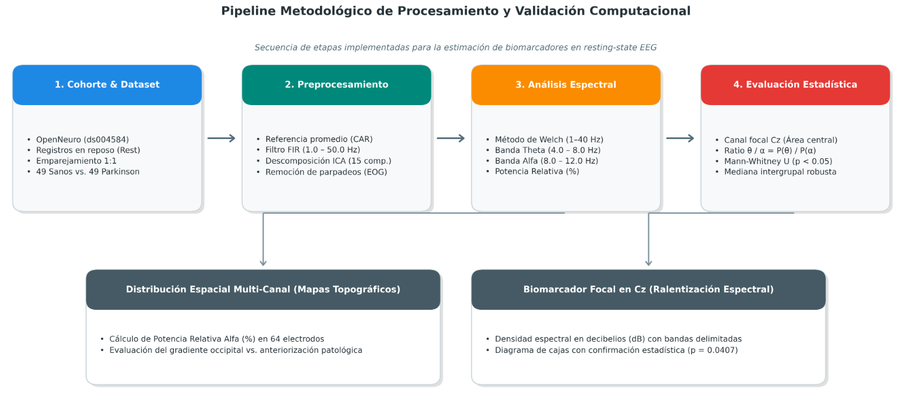
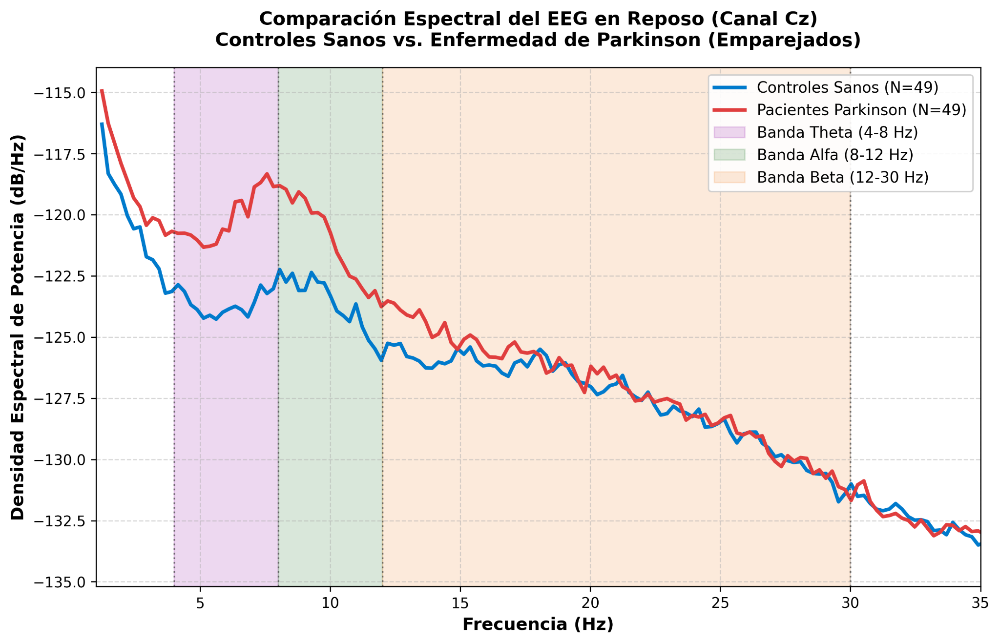
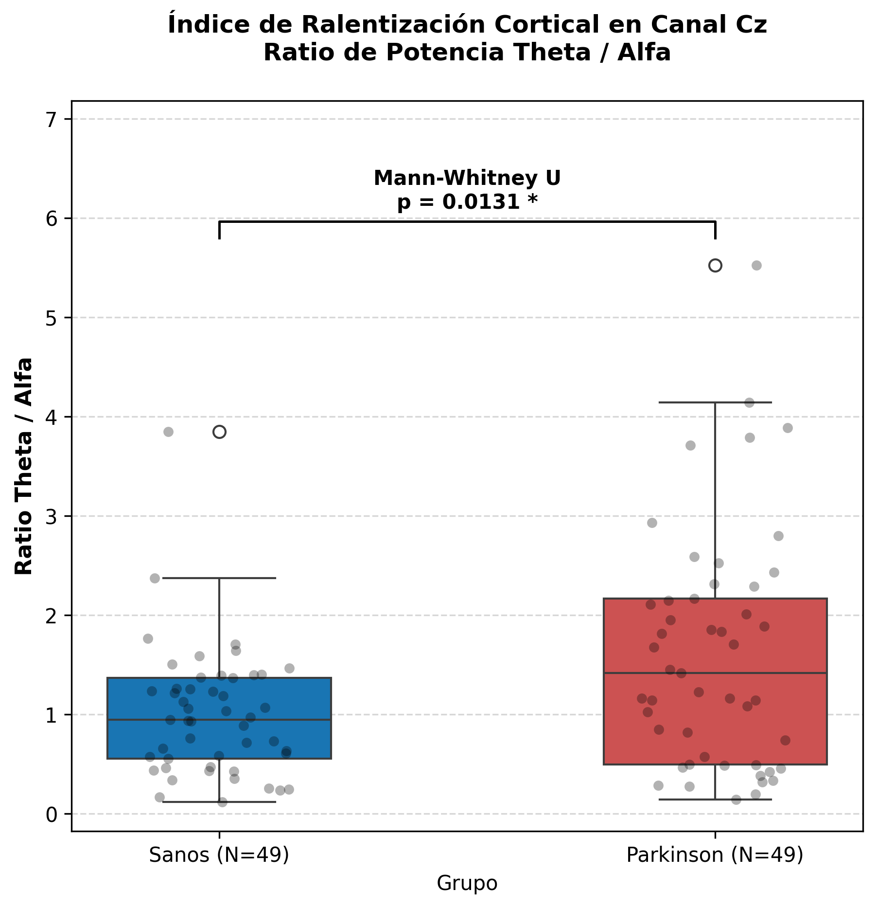
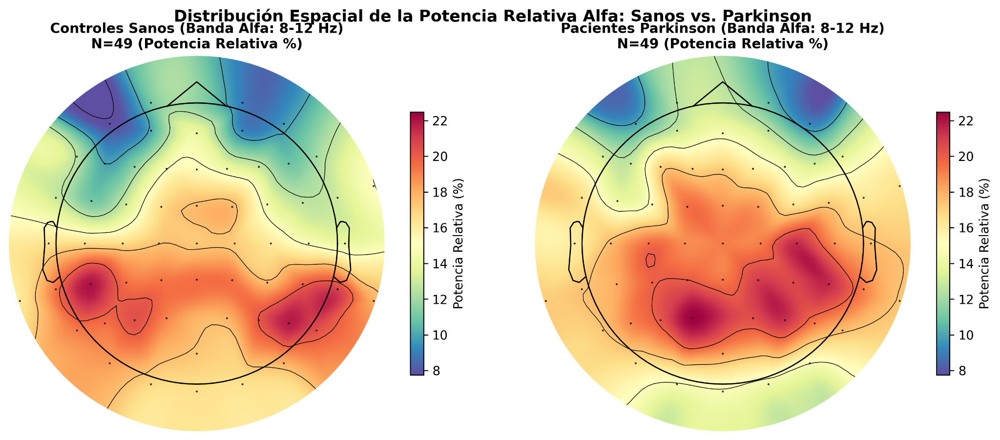

# Evaluación del Enlentecimiento Espectral en EEG como Biomarcador de Deterioro Cortical en la Enfermedad de Parkinson: Revisión de la literatura con Validación Computacional

**Danae Araus, Catalina Lizama y Samantha Sepúlveda**

## Resumen

El deterioro cognitivo constituye una manifestación no motora relevante de la enfermedad de Parkinson (EP) y se ha relacionado con alteraciones de la actividad electroencefalográfica en estado de reposo. El presente trabajo tuvo como objetivo analizar la evidencia sobre el enlentecimiento espectral del EEG como potencial biomarcador de disfunción cortical y evaluar la reproducibilidad de sus principales manifestaciones mediante una validación computacional. Se realizó una revisión de la literatura centrada en alteraciones de las bandas theta y alfa y en índices derivados de su relación. Paralelamente, se analizaron registros públicos del dataset OpenNeuro `ds004584`, seleccionando 49 pacientes con EP y 49 controles sanos emparejados por edad y sexo. Las señales fueron preprocesadas mediante re-referenciación, filtrado e ICA, y la densidad espectral de potencia se estimó mediante el método de Welch. La literatura mostró de manera consistente un aumento de actividad theta, alteraciones de alfa y una disminución de la relación Alfa/Theta asociadas al compromiso cognitivo. En la validación computacional, la relación Theta/Alfa en Cz fue significativamente mayor en pacientes con EP que en controles (U de Mann-Whitney, p=0.0407), concordando con un mayor predominio relativo de actividad lenta. Estos resultados respaldan la reproducibilidad del enlentecimiento espectral como fenómeno asociado a la EP, aunque la falta de estratificación cognitiva y la heterogeneidad metodológica impiden establecer la relación Theta/Alfa como biomarcador clínico validado.

## Palabras clave

Enfermedad de Parkinson; electroencefalografía; EEG; enlentecimiento espectral; ritmo alfa; ritmo theta; deterioro cognitivo; EEG en reposo.

## 1. Introducción

### 1.1. Enfermedad de Parkinson y deterioro cognitivo

La enfermedad de Parkinson (EP) es un trastorno neurodegenerativo progresivo caracterizado principalmente por la pérdida de neuronas dopaminérgicas de la sustancia negra y la consecuente alteración de los circuitos de los ganglios basales. Aunque sus manifestaciones motoras, como bradicinesia, rigidez y temblor, constituyen sus características clínicas más reconocidas, la enfermedad también presenta múltiples manifestaciones no motoras que pueden afectar significativamente la funcionalidad y calidad de vida de los pacientes [1].

Entre estas manifestaciones, el deterioro cognitivo adquiere especial relevancia y puede comprometer dominios como las funciones ejecutivas, atención, memoria y habilidades visuoespaciales. Su expresión clínica es heterogénea y puede abarcar desde alteraciones cognitivas leves hasta cuadros de demencia asociada a la enfermedad de Parkinson [2]. En este continuo, el deterioro cognitivo leve asociado a Parkinson (PD-MCI) corresponde a un estado de disminución cognitiva que no produce la interferencia funcional suficiente para establecer un diagnóstico de demencia, de acuerdo con los criterios propuestos por la Movement Disorder Society [3].

### 1.2. Necesidad de biomarcadores objetivos de disfunción cortical

La caracterización del deterioro cognitivo en la EP se basa principalmente en evaluaciones clínicas y neuropsicológicas. Si bien estas herramientas son fundamentales, existe interés en complementarlas con medidas neurofisiológicas objetivas y cuantificables que permitan estudiar los cambios funcionales cerebrales asociados al compromiso cognitivo. En este contexto, la electroencefalografía (EEG) constituye una alternativa no invasiva que permite registrar directamente la actividad eléctrica cerebral y analizar cuantitativamente sus características [4].

El EEG cuantitativo (qEEG) permite transformar los registros electroencefalográficos en parámetros medibles, entre ellos la potencia asociada a diferentes bandas de frecuencia. Diversos estudios han propuesto que estas características espectrales pueden aportar información sobre la disfunción cognitiva en la EP, lo que ha impulsado su investigación como posibles biomarcadores complementarios [5].

### 1.3. EEG en estado de reposo en la enfermedad de Parkinson

El EEG en estado de reposo permite estudiar la actividad cerebral espontánea sin requerir la ejecución de una tarea específica. Mediante el análisis cuantitativo de estos registros es posible caracterizar su composición espectral y examinar la actividad correspondiente a diferentes rangos de frecuencia, entre ellos theta y alfa [6]. Además, el análisis de registros breves de EEG en reposo ha mostrado asociaciones entre distintas características electroencefalográficas y el funcionamiento cognitivo en pacientes con EP [4].

En pacientes con enfermedad de Parkinson se han descrito alteraciones de esta organización espectral, particularmente en presencia de deterioro cognitivo. Entre los hallazgos más relevantes se encuentra un desplazamiento de la actividad hacia frecuencias más lentas, fenómeno que ha sido observado incluso en etapas tempranas de compromiso cognitivo [7]. Asimismo, la evidencia disponible señala que parámetros del qEEG, como la frecuencia dominante y la distribución relativa de potencia entre bandas, pueden relacionarse con el estado cognitivo y su evolución [6].

### 1.4. Enlentecimiento espectral como potencial biomarcador

Uno de los fenómenos electrofisiológicos de mayor interés en este contexto es el enlentecimiento espectral, entendido como un desplazamiento de la actividad EEG hacia frecuencias más bajas. En la EP con compromiso cognitivo, este patrón se ha asociado principalmente con un aumento de la actividad theta y una disminución de componentes de mayor frecuencia, especialmente de la actividad alfa [7]. La evidencia recopilada en estudios de qEEG también sugiere que este enlentecimiento puede relacionarse con el grado de deterioro cognitivo [6].

La relación entre las bandas theta y alfa resulta particularmente relevante, ya que permite integrar ambos cambios espectrales en una única medida. En pacientes con EP clasificados según su condición cognitiva, se ha observado un aumento de la potencia theta y una disminución de la relación Alfa/Theta en los grupos con mayor compromiso cognitivo [8].

En el presente estudio se utilizará la relación inversa, Theta/Alfa, de modo que un aumento de este índice representará un mayor predominio relativo de actividad lenta respecto de la actividad alfa. Por lo tanto, una disminución de Alfa/Theta descrita en la literatura es conceptualmente concordante con un aumento de Theta/Alfa, aunque ambas métricas deben diferenciarse al comparar sus valores y dirección de cambio.

Las alteraciones de la banda alfa también pueden manifestarse mediante cambios en su frecuencia y distribución cortical. Estudios recientes han mostrado una reducción de la frecuencia alfa dominante (*peak alpha frequency*, PAF) en pacientes con EP y alteraciones de la densidad espectral de potencia alfa asociadas al compromiso cognitivo, particularmente en regiones posteriores [9].

En conjunto, la evidencia sugiere un patrón caracterizado principalmente por aumento de actividad theta, disminución de actividad alfa, reducción de la frecuencia alfa dominante y modificación de la relación entre ambas bandas. Estas características han motivado la investigación del enlentecimiento espectral como un potencial biomarcador neurofisiológico del compromiso cognitivo asociado a la EP [5].

### 1.5. Brecha de conocimiento

A pesar de estos hallazgos, aún existe heterogeneidad entre los estudios respecto de las características de las poblaciones analizadas, las condiciones de registro, las regiones corticales evaluadas, la definición de las bandas de frecuencia y las métricas utilizadas para cuantificar el enlentecimiento. Algunos trabajos analizan potencia absoluta o relativa, otros consideran la frecuencia dominante y otros utilizan relaciones entre bandas, lo que dificulta establecer qué características espectrales presentan mayor consistencia [5].

Además, mientras algunos estudios destacan principalmente el aumento de theta y las modificaciones de la relación entre alfa y theta [8], otros identifican alteraciones relevantes de la potencia y frecuencia dominante de alfa [9]. Por ello, resulta relevante determinar cuáles de estos patrones son más consistentes a través de la literatura y evaluar si pueden reproducirse mediante un análisis computacional independiente.

### 1.6. Objetivo del estudio

A partir de estos antecedentes, el presente trabajo tiene como objetivo evaluar sistemáticamente la evidencia que relaciona el enlentecimiento espectral del EEG en estado de reposo con el deterioro cortical y cognitivo asociado a la enfermedad de Parkinson, y contrastar la reproducibilidad de sus principales manifestaciones mediante una validación computacional independiente.

La revisión se centrará principalmente en la disminución de la actividad alfa, el aumento de la actividad theta y las modificaciones de la relación entre ambas bandas. Posteriormente, mediante el análisis computacional de un dataset público de EEG, se estimará la densidad espectral de potencia en las bandas theta (4–8 Hz) y alfa (8–12 Hz), junto con la relación Theta/Alfa como índice de enlentecimiento espectral. Los resultados obtenidos serán contrastados con las tendencias identificadas en la literatura para determinar su grado de concordancia.

## 2. Metodología

### 2.1. Revisión de la literatura

Se realizó una revisión de la literatura con el propósito de identificar y sintetizar la evidencia disponible sobre el enlentecimiento espectral del EEG en estado de reposo como potencial biomarcador de deterioro cortical y cognitivo en pacientes con enfermedad de Parkinson. La revisión se orientó principalmente a estudios que evaluaran alteraciones en las bandas alfa y theta, cambios en la relación entre ambas bandas y otros parámetros espectrales relacionados con el deterioro cognitivo.

#### 2.1.1. Búsqueda y selección de estudios

La búsqueda bibliográfica se realizó mediante PubMed y plataformas de publicación científica como ScienceDirect, Frontiers y Nature, utilizando términos relacionados con enfermedad de Parkinson, EEG en estado de reposo, deterioro cognitivo, enlentecimiento espectral, alfa, theta y densidad espectral de potencia. Se seleccionaron los artículos más relevantes para los objetivos de la revisión, priorizando estudios que evaluaran alteraciones espectrales del EEG y su relación con el compromiso cognitivo en pacientes con enfermedad de Parkinson.

#### 2.1.2. Extracción y síntesis de la evidencia

De los estudios seleccionados se extrajo información sobre la población analizada, características del EEG, métricas espectrales utilizadas y principales hallazgos. La evidencia se sintetizó mediante un análisis narrativo centrado en la consistencia de tres patrones principales: disminución de la actividad alfa, aumento de la actividad theta y modificación de la relación entre ambas bandas, considerando además otros indicadores de enlentecimiento espectral cuando resultaron relevantes.

### 2.2. Validación computacional

Para contrastar la evidencia recopilada en la literatura con un entorno experimental cuantitativo, se implementó un pipeline de procesamiento y análisis espectral sobre registros de electroencefalografía en estado de reposo (*resting-state EEG*). La arquitectura del procesamiento computacional comprende cuatro etapas secuenciales: selección y emparejamiento de la muestra, preprocesamiento con remoción de artefactos, estimación espectral de potencia y evaluación estadística no paramétrica (Figura 1).

*Figura 1. Diagrama de flujo del pipeline metodológico de validación computacional. Describe la secuencia implementada desde la adquisición y emparejamiento de los registros EEG (N=49 por grupo), el preprocesamiento mediante filtrado pasa-banda e ICA, la estimación espectral por el método de Welch, hasta la comparación intergrupal mediante mapas topográficos y el cálculo del relación Theta/Alfa en el canal central Cz.*

#### 2.2.1. Dataset y población

Para la validación computacional se utilizó el conjunto de datos de acceso abierto depositado en el repositorio público OpenNeuro bajo el identificador `ds004584` [10]. Este repositorio contiene registros de electroencefalografía multicanal de alta densidad obtenidos durante condiciones de reposo basal (*resting-state EEG*, tarea task-Rest), adquiridos con un sistema de 64 canales siguiendo el estándar del sistema internacional 10-20.

La cohorte completa del dataset comprende un total de 149 registros válidos en reposo, distribuidos inicialmente de forma asimétrica en 100 pacientes diagnosticados con enfermedad de Parkinson (PD) y 49 voluntarios controles sanos (Control/HC). Con el fin de reducir el sesgo derivado del desbalance muestral y disminuir la influencia potencial de variables demográficas capaces de modificar los ritmos corticales, particularmente la edad y el sexo, se implementó un algoritmo determinista de emparejamiento 1:1 por vecino más cercano (*Nearest-Neighbor Matching*).

A través de este procedimiento, cada sujeto del grupo control fue emparejado con un paciente con enfermedad de Parkinson del mismo género y con la mínima diferencia en edad cronológica a partir de los metadatos demográficos disponibles (`participants.txt`). La muestra final analizada quedó conformada por:

- **Grupo Control Sanos (HC):** 49 sujetos sin antecedentes de patología neurológica.
- **Grupo Enfermedad de Parkinson (PD):** 49 pacientes diagnosticados con EP emparejados demográficamente.

El dataset incluye la caracterización clínica y cognitiva de los participantes mediante la escala de evaluación cognitiva de Montreal (Montreal Cognitive Assessment, MoCA) y la sección motora de la escala unificada de evaluación de la enfermedad de Parkinson (Unified Parkinson's Disease Rating Scale, UPDRS-III), lo que permite contextualizar el compromiso neurofuncional de la cohorte clínica evaluada.

#### 2.2.2. Preprocesamiento del EEG

El preprocesamiento de las señales continuas de EEG se implementó en Python mediante la librería especializada MNE-Python, aplicando un pipeline estandarizado destinado a mejorar la relación señal-ruido (SNR), reducir la contribución de artefactos fisiológicos y no fisiológicos y obtener señales apropiadas para la posterior estimación de las métricas espectrales.

1. **Re-referenciación espacial:** Los registros se transformaron a un esquema de referencia promedio común (*Common Average Reference*, CAR) libre de proyecciones residuales. Esta configuración permite una distribución homogénea del potencial a lo largo del cuero cabelludo y mitiga posibles sesgos topográficos inducidos por electrodos de referencia monopolares.

2. **Limpieza de canales periféricos:** Se identificaron y removieron electrodos no estándar o periféricos ubicados en la base iniónica inferior (Iz, I1, I2) para mantener una topología homogénea y evitar distorsiones por artefactos de contacto en la zona cervical.

3. **Filtrado digital pasa-banda:** Se aplicó un filtro digital de respuesta al impulso finita (FIR, diseño `firwin`) con una banda de paso configurada entre 1.0 Hz y 50.0 Hz.
   - La frecuencia de corte inferior (1.0 Hz) eliminó derivas lentas de línea base, potenciales galvánicos de la piel y componentes de polarización electrodo-electrolito.
   - La frecuencia de corte superior (50.0 Hz) limitó el análisis a las frecuencias de interés y redujo la contribución de componentes electromiográficos de alta frecuencia y otras fuentes de ruido situadas por encima de este rango.

4. **Remoción de artefactos biológicos mediante ICA:** Para eliminar la contaminación por parpadeos y movimientos oculares (Electrooculografía, EOG) sin perder épocas de señal continua, se aplicó un análisis de componentes independientes (ICA, *Independent Component Analysis*):
   - Se descompuso la señal filtrada en componentes espaciales independientes (N = 15).
   - Se implementó un algoritmo automatizado de correlación cruzada (`find_bads_eog`) utilizando los canales fronto-polares (Fp1, Fp2, AF3, AF4) como referencia de actividad ocular.
   - Las componentes independientes que capturaron la morfología del parpadeo fueron excluidas (`ica.exclude`) y la señal cortical limpia se reconstruyó mediante retroproyección espacial (`ica.apply`) antes de proceder a la cuantificación en frecuencia.

#### 2.2.3. Análisis espectral

Una vez obtenidas las señales preprocesadas y libres de artefactos oculares, se procedió a la cuantificación de la actividad oscilatoria cerebral en el dominio de la frecuencia mediante herramientas de procesamiento digital de señales:

1. **Estimación de la Densidad Espectral de Potencia (PSD):** La transformación al dominio de la frecuencia se calculó aplicando el método de Welch (*Welch's averaged modified periodogram*), implementado a través de la función `compute_psd` de MNE. Este método segmenta la señal continua en ventanas temporales superpuestas con apodización (ventana Hanning), promediando los periodogramas resultantes para reducir la varianza del estimador espectral y mitigar el impacto de discontinuidades transitorias del registro. El espectro se estimó en una ventana continua de interés de 1.0 Hz a 40.0 Hz.

2. **Delimitación de bandas clínicas de interés:** A partir del espectro global de frecuencias, se aislaron las bandas oscilatorias fundamentales vinculadas a la actividad en reposo y a los procesos de enlentecimiento cortical:
   - Banda Theta (θ): 4.0 ≤ f < 8.0 Hz.
   - Banda Alfa (α): 8.0 ≤ f ≤ 12.0 Hz.
   - Espectro Total de Referencia: 1.0 Hz−40.0 Hz utilizado como base para la normalización de la potencia relativa.

3. **Cálculo de Potencia Relativa para Topografías Espaciales:** Para analizar la distribución espacial a través de los 64 canales del cuero cabelludo sin que las variaciones anatómicas individuales (tales como el grosor craneal o la impedancia de contacto) distorsionarán los mapas de superficie, la potencia de la banda alfa se transformó a Potencia Relativa porcentual (Prel,α) por electrodo:

$$
   P_{\mathrm{rel},\alpha}=
   \frac{\sum_{f=8}^{12} PSD(f)}
   {\sum_{f=1}^{40} PSD(f)}
   \times 100
   $$

Esta normalización permitió representar y comparar descriptivamente la distribución espacial de la actividad alfa entre ambos grupos, incluyendo su patrón en regiones parieto-occipitales.

4. **Extracción de la relación Theta/Alfa en el Canal Central (Cz):** Para cuantificar el grado de enlentecimiento cortical focal, se seleccionó el canal central Cz, representativo de la corteza sensoriomotora y comúnmente empleado en la literatura para evitar la dispersión multicanal. A partir de este electrodo se calculó el índice espectral integrador:

$$
   \mathrm{relación}\ \theta/\alpha =
   \frac{PSD_{\theta}(Cz)}{PSD_{\alpha}(Cz)}
   =
   \frac{\frac{1}{N_{\theta}}\sum_{f=4}^{8} PSD_{Cz}(f)}
   {\frac{1}{N_{\alpha}}\sum_{f=8}^{12} PSD_{Cz}(f)}
   $$

Adicionalmente, los perfiles continuos de PSD en Cz se expresaron en escala logarítmica de Decibelios (dB/Hz) mediante la relación:

$$
   PSD_{\mathrm{dB}}(f)=10\log_{10}\left[PSD(f)\right]
   $$

facilitando la inspección visual de la caída de potencia en frecuencias intermedias y altas.

#### 2.2.4. Comparación entre grupos

La comparación entre los grupos Control y Parkinson se realizó mediante análisis descriptivos e inferenciales. En primer lugar, se compararon los perfiles espectrales promedio obtenidos en el electrodo Cz y la distribución topográfica grupal de la potencia relativa en banda alfa, con el propósito de visualizar diferencias en la organización espectral y espacial de la actividad EEG. Los mapas topográficos fueron utilizados como una representación descriptiva de la distribución de potencia y no como una prueba estadística por electrodo.

Para la evaluación cuantitativa del enlentecimiento espectral, se comparó la distribución individual de la relación Theta/Alfa en Cz entre los 49 controles sanos y los 49 pacientes con enfermedad de Parkinson mediante la prueba no paramétrica U de Mann-Whitney para muestras independientes. Se estableció un nivel de significancia de alpha=0.05, considerando estadísticamente significativas las diferencias con p<0.05.

## 3. Resultados

### 3.1. Resultados de la revisión de la literatura

Los estudios seleccionados mostraron, en términos generales, una tendencia hacia el enlentecimiento de la actividad electroencefalográfica en pacientes con enfermedad de Parkinson, especialmente en aquellos con compromiso cognitivo. Los cambios descritos con mayor frecuencia correspondieron a un incremento de la actividad en bandas lentas, principalmente theta, acompañado de alteraciones en la actividad alfa y en parámetros que representan el balance entre ambas bandas [5]-[9], [11]. Respecto de la actividad theta, Benz et al. reportaron un aumento de la potencia theta relativa y una disminución de la frecuencia mediana en pacientes con Parkinson y deterioro cognitivo temprano [7]. Zawiślak-Fornagiel et al. observaron además una mayor potencia theta absoluta en pacientes con demencia asociada a Parkinson respecto de pacientes cognitivamente preservados, junto con incrementos regionales de theta en áreas temporales y occipitales [8]. De manera concordante, Novak et al. encontraron mayor representación de theta en pacientes con deterioro cognitivo [5], mientras que el estudio multicéntrico de Jaramillo-Jimenez et al. identificó el aumento generalizado de theta como uno de los hallazgos más reproducibles entre cuatro cohortes independientes [11]. En relación con la actividad alfa, los estudios mostraron alteraciones tanto en su potencia como en su frecuencia y distribución cortical. Zhao et al. observaron una reducción global de la frecuencia alfa máxima en pacientes con Parkinson respecto de controles sanos y una menor densidad espectral de potencia alfa en regiones parieto-occipitales y temporales posteriores en pacientes con compromiso cognitivo [9]. Además, Babiloni et al. reportaron una menor reactividad de los ritmos alfa posteriores en pacientes con demencia asociada a Parkinson durante la transición desde ojos cerrados a ojos abiertos [12]. Las métricas que integran las bandas alfa y theta también mostraron diferencias según el estado cognitivo. Zawiślak-Fornagiel et al. encontraron una disminución significativa de la relación Alfa/Theta en pacientes con demencia en comparación con pacientes cognitivamente normales [8].

Debido a que en el presente estudio se utiliza la relación inversa, este resultado corresponde conceptualmente a un aumento de Theta/Alfa asociado a un mayor predominio relativo de actividad lenta.

De forma complementaria, algunos estudios identificaron otros cambios relacionados con la actividad cerebral en Parkinson, incluyendo disminuciones de la frecuencia dominante [7], modificaciones en la reactividad alfa posterior [12] y alteraciones de la complejidad de la señal EEG [18]. Sin embargo, debido a la diversidad de métodos, regiones corticales y métricas empleadas, no todos los estudios evaluaron las mismas variables. En conjunto, los resultados de la revisión muestran como patrón predominante un aumento de la actividad theta acompañado de alteraciones de alfa y de las relaciones entre bandas, compatible con un desplazamiento del espectro hacia frecuencias más lentas.

### 3.2. Resultados de la validación computacional

El análisis espectral en el canal Cz mostró una mayor densidad espectral de potencia en pacientes con Parkinson respecto de los controles sanos, particularmente en las bandas theta y alfa, con un pico desplazado hacia frecuencias más lentas (~8 Hz) y convergencia entre ambos grupos en la banda beta (>18 Hz) (Figura 2).

El Ratio Theta/Alfa en Cz resultó significativamente mayor en el grupo con Parkinson que en el grupo control (Mann-Whitney U, p = 0.0131), confirmando un mayor predominio relativo de actividad lenta en los pacientes pese al aumento observado en ambas bandas por separado (Figura 3).

En cuanto a la distribución espacial de la potencia relativa alfa, los controles sanos mostraron dos focos discretos de alta potencia en regiones parieto-occipitales bilaterales. En el grupo con Parkinson, estos focos aparecieron fusionados en una región posterior-central más extensa y continua, sugiriendo una reorganización de la topografía alfa antes que una reducción generalizada de su potencia (Figura 4).

*Figura 2. Perfil espectral de potencia en reposo en el electrodo Cz en controles sanos y pacientes con enfermedad de Parkinson.*

*Figura 3. Cuantificación del biomarcador de enlentecimiento espectral: Relación theta/alpha en electrodo Cz.*

*Figura 4. Distribución espacial de la potencia relativa en banda alfa en controles sanos y pacientes con enfermedad de Parkinson.*

### 3.3. Concordancia entre la literatura y la validación computacional

El principal punto de concordancia entre la evidencia revisada y la validación computacional correspondió al desplazamiento relativo de la actividad EEG hacia frecuencias más lentas. Diversos estudios han descrito un aumento de la actividad theta, una disminución de la relación Alfa/Theta y otros indicadores de enlentecimiento en pacientes con enfermedad de Parkinson y, particularmente, en aquellos con mayor compromiso cognitivo [5]–[9], [11], [14], [16]. En el presente análisis, esta tendencia se reprodujo mediante un aumento significativo de la relación Theta/Alfa en el grupo con Parkinson respecto de los controles (p = 0.0131).

La concordancia fue más clara para el balance entre theta y alfa que para las bandas consideradas de forma independiente. El perfil espectral en Cz no reprodujo directamente una reducción aislada de la potencia alfa en los pacientes con Parkinson, mientras que los mapas topográficos sugirieron una reorganización espacial de la potencia alfa —con fusión de focos posteriores discretos en una región más extensa en el grupo con Parkinson— aunque sin una prueba inferencial por electrodo que confirme estadísticamente esta diferencia. Por ello, los resultados computacionales respaldan principalmente la existencia de un mayor predominio relativo de actividad lenta, pero no permiten afirmar que todas las manifestaciones específicas descritas en la literatura hayan sido reproducidas.

Asimismo, debe considerarse que la validación comparó pacientes con enfermedad de Parkinson frente a controles sanos, mientras que una parte importante de la literatura relaciona el enlentecimiento con diferentes grados de deterioro cognitivo dentro de la propia EP. En consecuencia, la concordancia observada respalda la reproducibilidad del enlentecimiento espectral asociado a la enfermedad, pero no permite determinar a partir de este análisis si la magnitud de la relación Theta/Alfa aumenta progresivamente con el compromiso cognitivo.

## 4. Discusión

### 4.1. Hallazgos principales

En conjunto, la evidencia revisada respalda la presencia de un enlentecimiento de la actividad electroencefalográfica en la enfermedad de Parkinson (EP), particularmente asociado al compromiso cognitivo. Este fenómeno no parece corresponder a la modificación aislada de una única banda de frecuencia, sino a una redistribución de la actividad espectral hacia frecuencias más lentas, caracterizada principalmente por un aumento de theta, una reducción de la actividad alfa y una disminución de parámetros relacionados con la frecuencia dominante [5]-[9], [11]. Este patrón adquiere especial relevancia considerando que el deterioro cognitivo en la EP constituye un continuo heterogéneo que puede extenderse desde alteraciones cognitivas leves hasta demencia asociada a Parkinson [2], [3].

Entre los resultados más consistentes destaca el aumento de la actividad theta. Benz et al. observaron mayor potencia theta y una disminución de la frecuencia mediana en pacientes con EP y compromiso cognitivo temprano [7], mientras que Zawiślak-Fornagiel et al. encontraron una mayor potencia theta en pacientes con demencia respecto de aquellos cognitivamente preservados [8]. Esta tendencia fue reforzada por el estudio multicéntrico de Jaramillo-Jimenez et al., realizado en cuatro cohortes independientes, donde el aumento generalizado de theta y las alteraciones de frecuencias pre-alfa posteriores fueron los hallazgos espectrales más reproducibles [11]. La concordancia entre estudios con poblaciones y metodologías diferentes fortalece la hipótesis de que el enlentecimiento espectral representa una característica relativamente consistente de la EP.

Las alteraciones de alfa también contribuyen a este patrón. Se han descrito reducciones de su potencia asociadas al compromiso cognitivo [5], [9], disminución de la frecuencia alfa dominante [9] y alteraciones de la capacidad de los ritmos alfa posteriores para responder a cambios sensoriales [12], [13]. En este contexto, la relación entre actividad lenta y rápida podría aportar más información que el análisis aislado de una única banda. La disminución de la relación Alfa/Theta observada en pacientes con mayor deterioro cognitivo [8] proporciona así el fundamento para estudiar su relación inversa, Theta/Alfa, como un índice cuantitativo de enlentecimiento.

Sin embargo, estos resultados todavía no permiten considerar una única métrica espectral como un biomarcador clínico establecido. Existen diferencias importantes entre los estudios respecto de la definición de las bandas, uso de potencia absoluta o relativa, regiones analizadas, estado cognitivo de los pacientes y procedimientos de adquisición y procesamiento del EEG [6]. Por ello, la evidencia parece respaldar con mayor solidez el fenómeno general de enlentecimiento espectral que una medida específica y universal para cuantificarlo.

### 4.2. Disminución de la actividad alfa y disfunción cortical

Las alteraciones de la banda alfa representan uno de los principales componentes del enlentecimiento espectral asociado al deterioro cognitivo en la EP. Sin embargo, la evidencia indica que estas modificaciones no consisten únicamente en una reducción global de potencia, sino que también involucran cambios en la frecuencia dominante, distribución regional y capacidad de modulación de los ritmos alfa.

Zhao et al. observaron una menor frecuencia alfa máxima (*peak alpha frequency*, PAF) en pacientes con EP respecto de controles sanos. Además, los pacientes con compromiso cognitivo presentaron menor densidad espectral de potencia alfa en regiones parieto-occipitales y temporales posteriores que aquellos con cognición preservada, encontrándose asociaciones entre estas variables y el rendimiento cognitivo medido mediante MoCA [9]. Estos resultados sugieren que el compromiso de alfa podría presentar un componente regional importante, especialmente en áreas corticales posteriores.

Esta interpretación también es consistente con los estudios de reactividad alfa. Babiloni et al. observaron una menor capacidad de los ritmos alfa posteriores para desincronizarse durante la transición desde ojos cerrados a ojos abiertos en pacientes con demencia asociada a Parkinson [12]. Schumacher et al. encontraron de manera similar una reducción de la reactividad alfa en pacientes con demencia con cuerpos de Lewy, incluyendo sujetos con PDD, y mostraron que una menor reactividad se asociaba con un menor volumen del núcleo basal de Meynert, relación que fue particularmente evidente en el grupo PDD [13].

Estos hallazgos sugieren que la alteración alfa podría reflejar una modificación más amplia de la organización funcional cortical. La reducción de potencia posterior, el desplazamiento de su frecuencia dominante y la menor reactividad frente a la apertura ocular podrían representar diferentes manifestaciones de una menor capacidad para mantener y modular adecuadamente los ritmos corticales. No obstante, estos parámetros no necesariamente representan un mismo mecanismo fisiológico. En particular, la pérdida de reactividad alfa podría estar relacionada con alteraciones de los mecanismos de desincronización cortical y del sistema colinérgico, y no únicamente con el enlentecimiento global del EEG [13].

### 4.3. Aumento de theta y enlentecimiento espectral

El aumento de la actividad theta constituye uno de los hallazgos más consistentes entre los estudios analizados. Benz et al. observaron un incremento de la potencia theta relativa, particularmente en la región temporal izquierda, acompañado de una disminución de la frecuencia mediana en pacientes con EP y deterioro cognitivo temprano [7]. De forma concordante, Zawiślak-Fornagiel et al. reportaron mayor potencia theta absoluta en pacientes con demencia asociada a Parkinson respecto de pacientes cognitivamente normales, además de incrementos regionales de theta relativa en áreas temporales y occipitales [8].

Novak et al. obtuvieron resultados similares al comparar pacientes con EP cognitivamente preservados y pacientes con compromiso cognitivo, observando mayor representación de theta y menor actividad alfa y beta en el segundo grupo [5]. A su vez, Jaramillo-Jimenez et al. identificaron un aumento significativo de la potencia theta relativa en las cuatro cohortes estudiadas, convirtiendo este cambio en uno de los hallazgos con mayor reproducibilidad externa [11]. En conjunto, estos resultados indican que el incremento de actividad lenta constituye una característica recurrente de las alteraciones corticales asociadas a la EP.

La evidencia longitudinal aporta un elemento adicional. Kozak et al. siguieron durante tres años a pacientes con EP inicialmente sin demencia y encontraron que una mayor potencia theta global en la evaluación basal se asociaba con un mayor deterioro cognitivo posterior [14]. Además, la combinación de theta con variables motoras axiales mejoró la capacidad de identificar pacientes con mayor riesgo de empeoramiento cognitivo, sugiriendo que las medidas EEG podrían aportar información complementaria dentro de modelos pronósticos.

Sin embargo, es necesario distinguir la actividad theta espontánea del EEG en reposo de la actividad de baja frecuencia generada durante tareas cognitivas. Singh et al. observaron que un mayor deterioro cognitivo se relacionaba con una atenuación de la actividad delta/theta midfrontal evocada durante tareas de control cognitivo [15]. Este resultado aparentemente opuesto no contradice necesariamente el aumento de theta observado en reposo, ya que ambas medidas representan fenómenos neurofisiológicos diferentes: una mayor presencia de actividad lenta espontánea puede coexistir con una menor capacidad para generar respuestas oscilatorias específicas frente a demandas cognitivas. Por ello, los resultados de ambas aproximaciones deben considerarse complementarios y no directamente equivalentes.

### 4.4. Relación Theta/Alfa como potencial biomarcador

La presencia simultánea de un aumento de theta y una disminución de alfa proporciona fundamento para utilizar índices que integren ambas alteraciones. Zawiślak-Fornagiel et al. observaron una reducción significativa de la relación Alfa/Theta en los pacientes con mayor compromiso cognitivo, mostrando una tendencia desde cognición preservada hacia deterioro cognitivo leve y demencia [8]. Debido a que en el presente trabajo se utiliza la relación inversa, estos resultados implican que un aumento de Theta/Alfa representaría un mayor predominio relativo de actividad lenta y, por tanto, un mayor grado de enlentecimiento espectral.

Una de las principales ventajas de esta relación es que integra en una única medida dos fenómenos observados repetidamente en la literatura. Además, su asociación parece extenderse más allá del rendimiento cognitivo global. Eichelberger et al. observaron que una menor relación Alfa/Theta en regiones parietales y occipitales se relacionaba con peor rendimiento visuoespacial en pacientes con EP [16]. Este resultado resulta especialmente relevante debido a que el deterioro visuoespacial puede formar parte de las manifestaciones cognitivas de la enfermedad y sugiere que el enlentecimiento regional podría asociarse de manera diferencial con determinados dominios cognitivos.

No obstante, Theta/Alfa no debería considerarse todavía un biomarcador clínico independiente. Su valor depende directamente de la definición de las bandas, de la utilización de potencia absoluta o relativa y de las regiones corticales incorporadas en el cálculo. Además, el deterioro cognitivo se ha relacionado con otros componentes espectrales, como la disminución de la frecuencia dominante, el aumento de delta y la reducción de beta [5]–[7]. En este sentido, Anjum et al. mostraron que las modificaciones relacionadas con la cognición se distribuyen a través de múltiples componentes del espectro y que un índice construido a partir de información espectral más amplia presentó asociaciones con el rendimiento cognitivo superiores a las obtenidas mediante marcadores tradicionales individuales [4].

Por lo tanto, la relación Theta/Alfa presenta una ventaja interpretativa y computacional para representar el balance entre actividad lenta y alfa, pero la evidencia actual permite considerarla principalmente como un biomarcador candidato de enlentecimiento espectral, cuya utilidad clínica requiere validación independiente y estandarización metodológica.

### 4.5. Relación con la progresión del deterioro cognitivo

Uno de los aspectos más relevantes es determinar si las alteraciones espectrales reflejan únicamente el estado cognitivo presente o si también contienen información sobre su evolución. La EP presenta un continuo de compromiso cognitivo que puede extenderse desde una función relativamente preservada hasta PD-MCI y PDD [2], [3], pero la velocidad y trayectoria de esta evolución varían considerablemente entre pacientes.

Los estudios transversales muestran un gradiente compatible con un mayor enlentecimiento en estados cognitivos más avanzados. Zawiślak-Fornagiel et al. observaron mayor actividad theta y menor relación Alfa/Theta en pacientes con demencia respecto de aquellos cognitivamente preservados [8], mientras que Zhao et al. identificaron alteraciones regionales de alfa capaces de diferenciar pacientes con y sin compromiso cognitivo [9]. De manera similar, la revisión realizada por Cozac et al. mostró una asociación general entre mayor enlentecimiento del EEG y mayor deterioro cognitivo en la EP [6].

Sin embargo, las diferencias observadas entre grupos cognitivamente preservados, PD-MCI y PDD no demuestran por sí mismas que estos cambios progresen temporalmente dentro de un mismo individuo. Por esta razón, los estudios longitudinales resultan especialmente relevantes. Kozak et al. observaron que una mayor potencia theta global basal predecía un mayor empeoramiento cognitivo después de tres años [14]. Además, la combinación de theta con signos motores axiales proporcionó información complementaria, lo que plantea que la predicción del deterioro cognitivo podría beneficiarse de modelos que integren diferentes marcadores en lugar de depender exclusivamente de una variable EEG.

La asociación entre enlentecimiento y dominios cognitivos específicos también podría aportar información sobre este proceso. Eichelberger et al. relacionaron una menor razón Alfa/Theta parietal y occipital con un peor rendimiento visuoespacial [16]. Considerando que el compromiso cognitivo en Parkinson puede involucrar de forma diferencial funciones ejecutivas, atención, memoria y capacidades visuoespaciales [2], distintas características regionales del EEG podrían reflejar componentes diferentes del deterioro cognitivo.

En consecuencia, la evidencia disponible permite plantear que el enlentecimiento espectral posee potencial pronóstico, pero todavía no permite establecer que Theta/Alfa, o cualquier otra medida individual, pueda predecir de manera suficientemente precisa la transición desde PD-MCI hacia PDD. Para establecer esta utilidad serán necesarios estudios longitudinales de mayor tamaño, procedimientos de EEG más estandarizados y validación independiente de los modelos predictivos.

### 4.6. Interpretación neurofisiológica del enlentecimiento espectral

Los mecanismos responsables del enlentecimiento EEG en la EP probablemente sean multifactoriales. La enfermedad no se limita a la degeneración dopaminérgica nigroestriatal, sino que compromete progresivamente otras estructuras corticales y subcorticales y diferentes sistemas de neurotransmisión [1], [2]. Por ello, el aumento de theta y la disminución de alfa difícilmente pueden atribuirse exclusivamente a la pérdida de dopamina.

Uno de los mecanismos propuestos involucra al sistema colinérgico. La degeneración del núcleo basal de Meynert y la consecuente alteración de sus proyecciones corticales se han relacionado con el deterioro cognitivo en enfermedades asociadas a cuerpos de Lewy. Schumacher et al. encontraron que una menor reactividad alfa se asociaba con menor volumen del núcleo basal de Meynert y que esta relación era especialmente marcada en los pacientes con PDD [13]. Asimismo, Jaramillo-Jimenez et al. señalan que las alteraciones posteriores en frecuencias pre-alfa han sido vinculadas con modificaciones de estructuras colinérgicas del prosencéfalo basal [11]. Estos resultados ofrecen una posible conexión entre la alteración de sistemas neuromoduladores y los cambios espectrales observados en el EEG.

El sistema noradrenérgico constituye otro mecanismo potencial. Kemp et al. encontraron mayor potencia theta y delta en pacientes con EP respecto de controles y, dentro del grupo con Parkinson, una relación inversa entre la potencia theta y la densidad de receptores α₂-adrenérgicos en la corteza frontal [17]. Estos resultados apoyan la posibilidad de que la pérdida o disfunción de la neurotransmisión noradrenérgica contribuya tanto al enlentecimiento EEG como a alteraciones de funciones cognitivas relacionadas con la atención, vigilancia y memoria de trabajo.

Las modificaciones electroencefalográficas tampoco parecen limitarse a la distribución de potencia entre bandas. Nucci et al. identificaron diferencias en la complejidad de las señales EEG de pacientes con Parkinson mediante medidas de entropía aproximada, principalmente en bandas beta y regiones centrales y parietales [18]. Aunque la alteración de la complejidad y el enlentecimiento espectral corresponden a fenómenos diferentes, ambos aportan evidencia de una reorganización de la dinámica cortical asociada a la enfermedad.

En conjunto, el aumento de theta, la reducción o desplazamiento de alfa, las modificaciones de la relación Theta/Alfa y los cambios en otras propiedades dinámicas del EEG pueden interpretarse como manifestaciones complementarias de una alteración funcional de las redes cerebrales. La evidencia permite relacionar estos fenómenos con la disfunción de sistemas colinérgicos y noradrenérgicos y con el deterioro cognitivo, pero todavía no permite atribuir el enlentecimiento a un mecanismo neuropatológico único. Por ello, resulta más apropiado considerarlo como un marcador funcional de alteración de la dinámica cerebral, cuya expresión probablemente refleje la interacción de múltiples procesos neurodegenerativos.

### 4.7. Concordancia con la validación computacional

El principal resultado de la validación computacional fue un aumento significativo de la relación Theta/Alfa en el grupo con enfermedad de Parkinson respecto de los controles sanos (p = 0.0131). Este hallazgo es concordante con la tendencia general identificada en la literatura de EEG en reposo, donde se han descrito un mayor predominio de actividad theta, alteraciones de alfa y una disminución de la relación Alfa/Theta en pacientes con EP [5],

[7]–[9], [11]. En este sentido, el análisis computacional reprodujo principalmente el balance relativo hacia frecuencias más lentas, aunque no todas las alteraciones espectrales individuales descritas en los estudios fueron observadas de manera directa.

El trabajo de Singh et al. [15], realizado sobre participantes pertenecientes a la misma cohorte, aporta información complementaria, pero no constituye una réplica directa del presente resultado. Estos autores estudiaron respuestas delta/theta midfrontales evocadas durante tareas cognitivas y observaron una atenuación de dichas respuestas asociada a mayor disfunción cognitiva. En cambio, el presente análisis evaluó actividad espontánea en reposo y encontró un mayor valor de la relación Theta/Alfa en pacientes con EP. Por lo tanto, la dirección de ambos hallazgos no debe compararse directamente, ya que corresponden a condiciones experimentales y fenómenos fisiológicos diferentes.

La relevancia de esta comparación radica en que ambas aproximaciones identifican alteraciones de la dinámica de baja frecuencia en la EP mediante paradigmas distintos. Sin embargo, debido a que los análisis derivan de participantes pertenecientes a una misma cohorte, esta convergencia no puede considerarse una validación externa independiente. El principal aporte de la validación realizada en este trabajo consiste en reproducir, mediante un pipeline espectral diferente aplicado a registros de reposo, un patrón de enlentecimiento compatible con la evidencia obtenida en otras cohortes independientes.

### 4.8. Implicancias clínicas

Si el enlentecimiento espectral, y en particular la relación Theta/Alfa, refleja el compromiso cognitivo en la EP como sugiere la evidencia revisada, su principal utilidad potencial no estaría en reemplazar la evaluación neuropsicológica, sino en complementarla. A diferencia de biomarcadores de neuroimagen o de líquido cefalorraquídeo, el EEG es una técnica no invasiva, relativamente accesible y susceptible de repetirse en el tiempo, características que podrían resultar ventajosas para el seguimiento longitudinal. Las evaluaciones neuropsicológicas continúan siendo fundamentales, pero su aplicación repetida puede verse limitada por el tiempo de administración y por posibles efectos de aprendizaje [4], [6].

Ese es el escenario donde los datos de Kozak et al. cobran más sentido. Una mayor potencia theta basal predijo, a tres años, un mayor deterioro cognitivo, y esa capacidad predictiva mejoró al combinarla con signos motores axiales [14]. La lectura clínica más razonable no es "usar el EEG en vez de las pruebas cognitivas", sino integrarlo en modelos pronósticos que ayuden a decidir, por ejemplo, con qué frecuencia controlar a un paciente o cuándo derivarlo a un especialista.

También existe evidencia de una posible especificidad según el dominio cognitivo evaluado. Eichelberger et al. encontraron que una menor relación Alfa/Theta parieto-occipital se relacionaba con un peor rendimiento visuoespacial [16]. Si estos resultados se replican, determinadas características regionales del EEG podrían aportar información complementaria sobre dominios cognitivos específicos, además de las medidas globales de desempeño.

No obstante, la evidencia disponible aún no es suficiente para sustentar la implementación clínica de estas métricas. La relación alfa/theta específica no se generalizó bien entre las cuatro cohortes del estudio de Jaramillo-Jimenez et al. [11], y a eso se suma la falta de estandarización que ya se discutió [6]: no existen puntos de corte, ni protocolos de adquisición comunes, ni estudios que comparen directamente el valor que aporta el EEG por sobre las herramientas ya establecidas. Antes de pensar en su uso real se necesitan cohortes prospectivas y multicéntricas, y sobre todo, evidencia de que agrega algo que la evaluación neuropsicológica no entrega ya por sí sola.

### 4.9. Heterogeneidad metodológica

Un problema que atraviesa buena parte de la evidencia revisada es la falta de un estándar común para definir y medir el enlentecimiento espectral. Las bandas theta y alfa no siempre se delimitan con los mismos límites de frecuencia entre estudios; algunos trabajos usan potencia absoluta y otros potencia relativa, sin que ambas medidas sean directamente comparables entre sí [6]. A esto se suma que las regiones corticales analizadas varían de un estudio a otro, algunos se centran en electrodos posteriores, otros en regiones temporales o frontales, y otros promedian sobre todo el cuero cabelludo, lo que dificulta establecer si las discrepancias entre resultados reflejan diferencias reales entre poblaciones o simplemente diferencias metodológicas.

La definición del compromiso cognitivo tampoco es uniforme. Algunos estudios comparan grupos clasificados según criterios de PD-MCI y demencia asociada a Parkinson siguiendo escalas específicas [3], mientras que otros trabajan con puntajes continuos de pruebas como el MoCA sin categorización formal [4], [9]. Esta variabilidad afecta directamente la comparabilidad de los hallazgos, ya que un mismo paciente podría clasificarse de forma distinta según el criterio utilizado.

Las condiciones de registro constituyen otra fuente relevante de heterogeneidad. El estado de medicación dopaminérgica de los pacientes no siempre se controla ni se reporta de la misma manera [5], y la condición ocular durante el registro (ojos abiertos versus ojos cerrados) puede modificar sustancialmente la actividad alfa, como lo muestran los hallazgos sobre reactividad alfa posterior [12]. A esto se agregan diferencias en el número de canales, el sistema de adquisición y los procedimientos de limpieza de artefactos entre laboratorios, factores que rara vez se estandarizan entre estudios independientes.

La validación computacional del presente trabajo tampoco escapa a esta misma limitación. Las decisiones tomadas —bandas Theta (4–8 Hz) y Alfa (8–12 Hz), electrodo Cz como foco de análisis, referencia promedio común, filtrado FIR entre 1 y 50 Hz— representan un conjunto particular de elecciones metodológicas entre varias opciones igualmente válidas dentro de la literatura. El resultado obtenido, por tanto, debe entenderse como una instancia más dentro de ese mismo espacio de heterogeneidad, no como una medición neutral o libre de supuestos. Esto no invalida la concordancia encontrada con la literatura, pero sí obliga a leerla con cierta cautela: que un patrón se reproduzca bajo un conjunto distinto de decisiones metodológicas es una señal alentadora, aunque no basta para afirmar que el fenómeno es independiente de cómo se decida medirlo.

### 4.10. Limitaciones

Este trabajo presenta limitaciones que es necesario reconocer, tanto en la revisión de literatura como en la validación computacional.

La revisión no siguió un protocolo formal como PRISMA, ni se definieron de antemano criterios explícitos de inclusión y exclusión o una evaluación sistemática del riesgo de sesgo en los estudios considerados. Se optó, en cambio, por un análisis narrativo centrado en los estudios más representativos de los patrones espectrales de interés, lo que permite profundizar en la interpretación de cada hallazgo pero no garantiza una cobertura exhaustiva de toda la literatura disponible sobre el tema. Esto introduce cierto margen de subjetividad en la selección de los estudios representados, algo inherente a este formato de revisión y no exclusivo de este trabajo. A esto se suma que el número de trabajos incluidos es reducido y que la mayoría son estudios transversales, por lo que las conclusiones sobre cómo evoluciona el enlentecimiento espectral en el tiempo descansan casi por completo en el puñado de estudios longitudinales citados [14].

En la validación computacional, el presente análisis se limitó a comparar pacientes con Parkinson y controles sanos, sin realizar una estratificación de los pacientes según su estado cognitivo. Por ello, el aumento de la relación Theta/Alfa observado permite contrastar la presencia de enlentecimiento espectral asociada a la EP, pero no verificar directamente el hallazgo más específico de la revisión: que este fenómeno se acentúa a medida que aumenta el compromiso cognitivo. El dataset `ds004584` incluye puntajes MoCA, pero estos no fueron utilizados como variable de estratificación ni de correlación en el análisis realizado. En consecuencia, esta constituye una limitación del alcance metodológico del presente trabajo y no una limitación inherente al conjunto de datos.

Vale la pena aclarar también que el enfoque de esta validación no replica el de los propios creadores del dataset. Singh et al. diseñaron `ds004584` pensando principalmente en el estudio de actividad evocada durante una tarea de control cognitivo, y su análisis se centró en esa condición activa para predecir disfunción cognitiva [15]. Aquí, en cambio, solo se usaron los registros de reposo del mismo dataset, dejando de lado la parte correspondiente a la tarea. La elección de este dataset y no de otro pensado específicamente para resting-state respondió a que ofrecía una muestra amplia y bien documentada, 149 sujetos con datos demográficos, MoCA y UPDRS-III disponibles, de acceso público y con protocolo de adquisición claro, algo que no siempre se encuentra reunido en otros datasets abiertos de EEG en Parkinson. Se priorizó, entonces, el tamaño muestral y la calidad de los metadatos por sobre la fidelidad al diseño original del dataset. Esto implica que la convergencia con Singh et al. [15] discutida antes debe leerse como eso: una coincidencia entre dos análisis con objetivos y condiciones de registro distintos dentro de la misma cohorte, no como una réplica de su metodología.

Finalmente, el análisis espectral se limitó a un solo electrodo (Cz) y a dos bandas de frecuencia, dejando fuera otras variables que la revisión sí menciona como relevantes, como la frecuencia dominante o la potencia en delta y beta [5]-[7]. Tampoco se controló el estado de medicación dopaminérgica de los participantes al momento del registro, ni se ajustó por covariables más allá del emparejamiento por edad y sexo. Y al depender de un único dataset y una sola comparación estadística no paramétrica, el hallazgo todavía no ha sido puesto a prueba en otras cohortes, por lo que su generalización debe tomarse como preliminar.

### 4.11. Líneas futuras

A partir de las limitaciones señaladas, se pueden identificar algunas direcciones que ayudarían a fortalecer tanto la evidencia sobre el enlentecimiento espectral como su eventual aplicación clínica.

Lo primero es avanzar hacia una mayor estandarización metodológica. Definir de forma consensuada los límites de frecuencia de las bandas theta y alfa, el tipo de potencia a reportar (absoluta o relativa) y las regiones de interés permitiría comparar resultados entre estudios de manera más directa, algo que hoy limita bastante la síntesis de la evidencia [6]. El trabajo multicéntrico de Jaramillo-Jimenez et al. ya representa un paso en esa dirección, al comparar cuatro cohortes bajo un mismo marco analítico mediante análisis funcional de datos [11]; extender ese tipo de enfoque a otras bases abiertas, incluyendo `ds004584` [10], ayudaría a determinar si el aumento del relación Theta/Alfa encontrado en este trabajo se sostiene bajo condiciones de análisis más exigentes.

Otra dirección relevante es incorporar el enlentecimiento espectral a modelos multimodales de predicción, en vez de evaluarlo de forma aislada. Almgren et al. desarrollaron recientemente un modelo de aprendizaje automático que combina neuroimagen estructural, biomarcadores de líquido cefalorraquídeo y datos clínicos para predecir el deterioro cognitivo continuo en pacientes con EP de etapas tempranas, y encontraron que los modelos multimodales superan consistentemente a los que usan una sola fuente de datos [19]. Un enfoque parecido, que sume variables EEG como el relación Theta/Alfa a marcadores motores, bioquímicos o de imagen, podría capturar mejor la naturaleza multifactorial del deterioro cognitivo en la EP de lo que logra cualquiera de estas fuentes por separado.

También hacen falta estudios longitudinales más largos y con muestras más grandes que las disponibles actualmente. El trabajo de Kozak et al., con tres años de seguimiento, sugiere que la potencia theta basal tiene valor pronóstico [14], pero sigue siendo un hallazgo relativamente aislado que necesita replicarse en otras cohortes y con distintos horizontes temporales antes de poder considerarse consistente.

Por último, futuras extensiones de esta validación deberían incorporar directamente la información cognitiva disponible en el dataset, utilizando los puntajes MoCA para estratificar a los pacientes o evaluar asociaciones continuas entre rendimiento cognitivo y métricas espectrales. Esto permitiría determinar si el enlentecimiento distingue no solo entre pacientes con EP y controles sanos, sino también entre diferentes grados de compromiso cognitivo dentro de la propia enfermedad, abordando de manera más directa la pregunta central planteada en esta revisión.

## 5. Conclusiones

La evidencia revisada muestra que el EEG en estado de reposo presenta alteraciones espectrales recurrentes en la enfermedad de Parkinson, caracterizadas principalmente por un desplazamiento de la actividad hacia frecuencias más lentas. Entre los hallazgos más consistentes se encuentran el aumento de theta, las alteraciones de la actividad alfa, la reducción de parámetros de frecuencia dominante y la modificación del balance entre ambas bandas. En conjunto, estos resultados respaldan al enlentecimiento espectral como un potencial marcador funcional del compromiso cortical y cognitivo asociado a la enfermedad, aunque la heterogeneidad metodológica todavía impide establecer una métrica clínica única y estandarizada.

La validación computacional realizada sobre el dataset público `ds004584` mostró un aumento significativo de la relación Theta/Alfa en el electrodo Cz de pacientes con Parkinson respecto de controles sanos (p = 0.0131). Este resultado es concordante con la dirección general descrita en la literatura y demuestra que el predominio relativo de actividad lenta puede reproducirse mediante un pipeline independiente de procesamiento y análisis espectral. Sin embargo, no todas las manifestaciones individuales descritas en los estudios, como la disminución aislada de alfa, fueron reproducidas de manera directa.

Por lo tanto, la relación Theta/Alfa constituye un índice candidato de enlentecimiento espectral, pero los resultados obtenidos no son suficientes para establecerla como biomarcador clínico del deterioro cognitivo. El análisis realizado permitió diferenciar pacientes con Parkinson de controles, pero no evaluó directamente diferentes grados de compromiso cognitivo dentro del grupo clínico. Futuros estudios deberían incorporar estratificación o análisis continuo según MoCA, cohortes independientes, diseños longitudinales y procedimientos estandarizados de adquisición y procesamiento para determinar su verdadero valor pronóstico y clínico.

## 6. Bibliografía

[1] D. K. Simon, C. M. Tanner, and P. Brundin, "Parkinson disease epidemiology, pathology, genetics, and pathophysiology," Clin. Geriatr. Med., vol. 36, no. 1, pp. 1–12, feb. 2020, doi:10.1016. /j.cger.2019.08.002.

[2] Y. Degirmenci, E. Angelopoulou, V. E. Georgakopoulou, and A. Bougea, "Cognitive impairment in Parkinson's disease: An updated overview focusing on emerging pharmaceutical treatment approaches," Medicina, vol. 59, no. 10, art. 1756, oct. 2023, doi:10.3390. /medicina59101756.

[3] I. Litvan, J. G. Goldman, A. I. Tröster, B. A. Schmand, D. Weintraub, R. C. Petersen, et al., "Diagnostic criteria for mild cognitive impairment in Parkinson's disease: Movement Disorder Society Task Force guidelines," Mov. Disord., vol. 27, no. 3, pp. 349–356, mar. 2012. , doi: 10.1002/mds.24893.

[4] M. F. Anjum, A. I. Espinoza, R. C. Cole, A. Singh, P. May, E. Y. Uc, S. Dasgupta, and N. S. Narayanan, "Resting-state EEG measures cognitive impairment in Parkinson's disease," NPJ Parkinsons Dis., vol. 10, no. 1, art. 6, ene. 2024, doi: 10.1038/s41531-023-00602-0.

[5] K. Novak, B. A. Chase, J. Narayanan, P. Indic, and K. Markopoulou, "Quantitative electroencephalography as a biomarker for cognitive dysfunction in Parkinson's disease," Front. Aging Neurosci., vol. 13, art. 804991, 2022, doi: 10.3389/fnagi.2021.804991.

[6] V. V. Cozac, U. Gschwandtner, F. Hatz, M. Hardmeier, S. Rüegg, and P. Fuhr, "Quantitative EEG and cognitive decline in Parkinson's disease," Parkinsons Dis., vol. 2016, art. 9060649, 2016, doi: 10.1155/2016/9060649.

[7] N. Benz, F. Hatz, H. Bousleiman, et al., "Slowing of EEG background activity in Parkinson's and Alzheimer's disease with early cognitive dysfunction," Front. Aging Neurosci., vol. 6, art. 314, 2014, doi: 10.3389/fnagi.2014.00314.

[8] K. Zawiślak-Fornagiel, D. Ledwoń, M. Bugdol, et al., "The increase of theta power and decrease of alpha/theta ratio as a manifestation of cognitive impairment in Parkinson's disease," J. Clin. Med., vol. 12, no. 4, art. 1569, 2023, doi: 10.3390/jcm12041569.

[9] Y. Zhao, J. Cai, J. Song, et al., "Peak alpha frequency and alpha power spectral density as vulnerability markers of cognitive impairment in Parkinson's disease: An exploratory EEG study," Front. Neurosci., vol. 19, art. 1575815, 2025, doi: 10.3389/fnins.2025.1575815.

[10] A. Singh, R. C. Cole, A. I. Espinoza, J. F. Cavanagh, and N. S. Narayanan, "Rest eyes open," OpenNeuro, dataset `ds004584`, versión 1.0.0, 2023, doi:10.18112. /openneuro.`ds004584`.v1.0.0.

[11] A. Jaramillo-Jimenez, D. A. Tovar-Rios, J. A. Ospina, et al., "Spectral features of resting-state EEG in Parkinson's disease: A multicenter study using functional data analysis," Clin. Neurophysiol., vol. 151, pp. 28–40, 2023, doi: 10.1016/j.clinph.2023.03.363.

[12] C. Babiloni, G. Noce, F. Tucci, et al., "Poor reactivity of posterior electroencephalographic alpha rhythms during the eyes open condition in patients with dementia due to Parkinson's disease," Neurobiol. Aging, vol. 135, pp. 1–14, 2024, doi10.1016. /j.neurobiolaging.2023.11.010.

[13] J. Schumacher, A. J. Thomas, L. R. Peraza, M. Firbank, R. Cromarty, C. A. Hamilton, P. C. Donaghy, J. T. O'Brien, and J. P. Taylor, "EEG alpha reactivity and cholinergic system integrity in Lewy body dementia and Alzheimer's disease," Alzheimers Res. Ther., vol. 12, art. 46, 2020, doi: 10.1186/s13195-020-00613-6.

[14] V. V. Kozak, M. Chaturvedi, U. Gschwandtner, F. Hatz, A. Meyer, V. Roth, and P. Fuhr, "EEG slowing and axial motor impairment are independent predictors of cognitive worsening in a three-year cohort of patients with Parkinson's disease," Front. Aging Neurosci., vol. 12, art. 171, 2020, doi: 10.3389/fnagi.2020.00171.

[15] A. Singh, R. C. Cole, A. I. Espinoza, J. R. Wessel, J. F. Cavanagh, and N. S. Narayanan, "Evoked mid-frontal activity predicts cognitive dysfunction in Parkinson's disease," J. Neurol. Neurosurg. Psychiatry, vol. 94, no. 11, pp. 945–953, jun. 2023, doi:10.1136. /jnnp-2022-330154.

[16] D. Eichelberger, P. Calabrese, A. Meyer, M. Chaturvedi, F. Hatz, P. Fuhr, and U. Gschwandtner, "Correlation of visuospatial ability and EEG slowing in patients with Parkinson's disease," Parkinsons Dis., vol. 2017, art. 3659784, 2017, doi:10.1155. /2017/3659784.

[17] A. F. Kemp, M. Kinnerup, B. Johnsen, S. Jakobsen, A. Nahimi, and A. Gjedde, "EEG frequency correlates with α₂-receptor density in Parkinson's disease," Biomolecules, vol. 14, no. 2, art. 209, 2024, doi: 10.3390/biom14020209.

[18] L. Nucci, F. Miraglia, C. Pappalettera, P. M. Rossini, and F. Vecchio, "Exploring the complexity of EEG patterns in Parkinson's disease," GeroScience, vol. 47, pp. 837–849, 2025. , doi: 10.1007/s11357-024-01277-y.

[19] H. Almgren, M. Camacho, A. Hanganu, M. Kibreab, R. Camicioli, Z. Ismail, N. D. Forkert, and O. Monchi, "Machine learning-based prediction of longitudinal cognitive decline in early Parkinson's disease using multimodal features," Sci. Rep., vol. 13, no. 1, art. 13193, ago. 2023, doi: 10.1038/s41598-023-37644-6.
