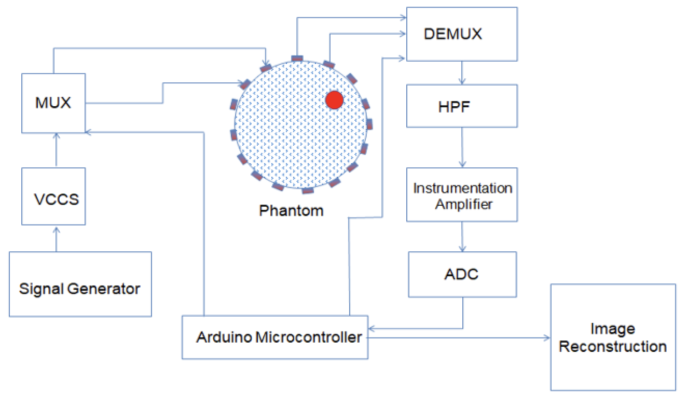

# Análisis del rendimiento diagnóstico y limitaciones técnicas de la Tomografía por Electroimpedancia para la detección del cáncer de mama: Revisión bibliográfica

Renata Bucarel Salvatierra $^{1}$, Antonia Contreras Naredo$^{2}$,
Renata Contreras Mancilla$^{3}$
   
*Universidad de Santiago de Chile, Facultad de Ingeniería, Ingeniería Civil Biomédica*

---

## Resumen

El cáncer de mama es una de las principales causas de mortalidad
oncológica femenina a nivel mundial, motivo por el cual se ha impulsado
la investigación de métodos diagnósticos complementarios como la
Tomografía por Impedancia Eléctrica (EIT). Esta técnica permite generar
imágenes funcionales a partir de las diferencias en las propiedades
eléctricas de los tejidos, sin utilizar radiación ionizante. El objetivo
de esta revisión bibliográfica fue analizar el desempeño diagnóstico
reportado y las principales limitaciones técnicas y metodológicas de la
EIT para la detección del cáncer de mama, considerando su influencia en
la comparación y aplicabilidad clínica de los resultados. Se realizó una
búsqueda en Google Scholar, PubMed, ScienceDirect e IEEE Xplore,
complementada con una revisión manual de referencias. De 21
publicaciones evaluadas, se seleccionaron 11, donde cinco fueron
estudios técnicos, dos estudios clínicos y cuatro artículos de revisión.
Los estudios técnicos mostraron una amplia variabilidad en el número y
disposición de los electrodos, parámetros de excitación, métodos de
adquisición, procesamiento y algoritmos de reconstrucción. Aunque
algunas configuraciones lograron mejorar la localización de anomalías y
reducir el error de reconstrucción, sus resultados no fueron
directamente comparables debido a las diferencias en los modelos y
procedimientos de validación. En la evidencia clínica, se reportó una
sensibilidad agrupada de 75,88%, una especificidad de 82,04% y una
elevada heterogeneidad. Los estudios individuales presentaron resultados
variables según la población, el diseño y el estándar de referencia
utilizado. Se concluye que la EIT mamaria posee potencial como
herramienta complementaria de evaluación diagnóstica, no obstante, la
falta de estandarización técnica, la heterogeneidad metodológica y la
limitada validación clínica impiden establecer un desempeño uniforme o
respaldar su utilización como reemplazo de los métodos convencionales,
por lo que se requieren estudios prospectivos y multicéntricos con
protocolos estandarizados.

**Palabras clave:** Tomografía por impedancia eléctrica; cáncer de mama;
electroimpedancia mamaria; desempeño diagnóstico; reconstrucción de
imágenes.

## Introducción

El cáncer de mama es el tipo de cáncer más frecuente en la población
femenina y la causa principal de mortalidad oncológica a nivel mundial y
puede afectar a mujeres de cualquier edad a partir de la pubertad,
siendo la mayor tasa entre las mujeres adultas [1]. Durante el
2024, se diagnosticaron alrededor de 2,4 millones de casos en el mundo,
donde se le atribuyen 694.000 fallecimientos registrados en ese mismo
periodo [2]. En Chile, la realidad no es muy distinta y llega a ser
aún más preocupante ya que es la principal causa de mortalidad
oncológica en mujeres. La mortalidad ha ido en aumento desde 2010 a
2024, aumentando de 14,9 a 18 por cada 100.000 mujeres, se estima que al
2050 esta mortalidad aumente aún más, por lo que es importante
fortalecer la prevención primaria, la pesquisa precoz y el acceso
equitativo a tratamientos efectivos [11]. La detección
temprana y oportuna es la estrategia más eficaz para reducir su
mortalidad, logrando una supervivencia del 99% en estadio localizado, y
la técnica más utilizada para su detección es la mamografía
[3], [4]. Sin embargo, su desempeño puede disminuir para
determinadas poblaciones, por ejemplo, en mujeres con tejido mamario muy
denso que poseen un tumor con una densidad similar, donde éste podría
quedar oculto o enmascararse, debido a que la superposición de los
tejidos dificulta la visualización de lesiones [5]. Por otra
parte, es un método que utiliza rayos X, lo que implica una exposición a
bajas dosis de radiación ionizante que se suman con la repetición de
cada examen, y aunque el riesgo asociado es mucho menor frente al
beneficio, constituye una razón adicional para investigar sobre otros
métodos complementarios o alternativos [6].

Desde otra perspectiva, en un estudio realizado en el 2000 en los Países
Bajos, evidenció que un 72,9% de las pacientes que se realizaron una
mamografía la califican como leve a dolorosa [7], mientras
que otro estudio reveló que la incomodidad o dolor durante el examen
afecta la satisfacción del paciente [8]. Estas molestias son
más significativas en pacientes con mamas densas y las principales
causas de dolor son la fuerza de compresión y el tiempo de duración que
es de 10-14 segundos, donde a menudo se solicita a la paciente contener
la respiración y se debe repetir desde distintos ángulos
[9], [10]. Estos factores, influyen al momento de
agendar la hora para la mamografía anual preventiva, si es que la
persona tuvo una mala experiencia previa. Existe además una baja
cobertura nacional de tamizaje, la cual no supera el 40%. Una de las
razones, es el miedo al examen tanto por el dolor que puede causar como
por lo que significa [3], [12].

En este contexto, frente a las limitaciones especificadas y al problema
de salud pública que esto representa, se han desarrollado
investigaciones de diversas tecnologías, entre ellas, la Tomografía por
Impedancia Eléctrica o Electroimpedancia (EIT). Esta es una técnica de
imágenes médicas no invasiva, la cual funciona a través de electrodos
conectados en la superficie del cuerpo humano que inyectan corriente
eléctrica, luego se mide y se compara la distribución de impedancia
eléctrica de los distintos tejidos del cuerpo. En este sentido, los
tumores son reconocidos ya que el tejido maligno posee la particularidad
de exhibir una mayor conductividad eléctrica en comparación a los
tumores benignos [23].

Al compararla con otras técnicas de obtención de imágenes, la EIT
presenta ventajas significativas, ya que no utiliza radiación, es no
invasiva, tiene bajo costo, puede utilizarse en dispositivos portables o
"wearables" lo que permitiría un monitoreo en tiempo real, entre otros.
Asimismo, su desventaja principal es la baja resolución espacial y la
dificultad de reconstruir la imagen capa a capa dada la baja frecuencia
de corriente eléctrica. Para este último problema, se han desarrollado
diferentes soluciones de hardware y algoritmos de reconstrucción de
imagen, que hasta hace un tiempo, estos no eran suficientes para
considerarla una tecnología única de diagnóstico y debía utilizarse en
paralelo a otras técnicas [15].

### Pregunta de investigación

¿Qué resultados de desempeño diagnóstico han sido reportados para la
tomografía por impedancia eléctrica mamaria en la detección de cáncer de
mama y qué diferencias técnicas y metodológicas limitan la comparación y
utilidad clínica de estos resultados?

#### Objetivo general

Analizar el desempeño diagnóstico reportado y las principales
limitaciones técnicas y metodológicas de la tomografía por impedancia
eléctrica mamaria, considerando su influencia en la comparación y
aplicabilidad clínica de los resultados.

#### Objetivos específicos

1.  Describir y comparar métodos o configuraciones técnicas utilizadas
    en los sistemas de Tomografía por Electroimpedancia Mamaria,
    considerando el número de electrodos y su disposición, frecuencia,
    corriente, método de adquisición, procesamiento de la señal y
    algoritmo de reconstrucción.

2.  Caracterizar el desempeño diagnóstico reportado en distintas
    poblaciones y contextos de aplicación, teniendo en cuenta
    sensibilidad, especificidad, exactitud, estándar de referencia y
    principales limitaciones metodológicas.

## Marco teórico

### Propiedades eléctricas del tejido mamario

La Tomografía por Electroimpedancia (EIT) se fundamenta en que los
tejidos biológicos poseen propiedades eléctricas intrínsecas que
determinan su comportamiento frente al paso de una corriente alterna de
baja intensidad [16]. Las principales propiedades involucradas
son la conductividad, la permitividad y la impedancia, las cuales
dependen de la composición, estructura y contenido de agua de cada
tejido [15]. Debido a que estas propiedades varían entre
distintos tipos de tejido, es posible utilizarlas como biomarcadores
para generar imágenes funcionales mediante EIT [16].

La conductividad representa la facilidad con que un tejido permite el
flujo de corriente eléctrica, mientras que la permitividad describe su
capacidad para almacenar carga eléctrica en presencia de un campo
eléctrico [15]. Por su parte, la impedancia corresponde a la
oposición total que presenta un tejido al paso de corriente alterna,
integrando tanto componentes resistivos como capacitivos [16].
Estas propiedades eléctricas permiten diferenciar tejidos con distinta
composición biológica y constituyen la base física de la reconstrucción
de imágenes por EIT [15].

En el tejido mamario existen diferencias eléctricas demostrables entre
el tejido adiposo, el tejido fibroglandular, los tumores benignos y los
tumores malignos [17]. Diversas investigaciones han demostrado
que el tejido tumoral maligno presenta una mayor conductividad y una
menor impedancia en comparación con el tejido mamario sano o con
lesiones benignas [17]. Este contraste eléctrico es el principio
biofísico que permite identificar regiones sospechosas durante la
reconstrucción de imágenes mediante EIT [18].

El aumento de conductividad observado en los tumores malignos se explica
por cambios característicos del microambiente tumoral [17]. Las
células cancerígenas presentan un mayor contenido de agua libre, mayor
concentración de iones, incremento de la vascularización y alteraciones
en la permeabilidad y organización de sus membranas celulares, factores
que facilitan el transporte de carga eléctrica a través del tejido
[18]. Como consecuencia, los tumores malignos exhiben una
conductividad significativamente superior a la del tejido adiposo y del
tejido mamario normal [17].

Cuando un sistema de EIT inyecta una corriente alterna de amplitud
constante a través de los electrodos, las variaciones de impedancia
presentes en el interior del tejido modifican la distribución de
potencial eléctrico medida en la superficie [15]. Estas
diferencias de voltaje constituyen las mediciones de entrada para los
algoritmos de reconstrucción, los cuales estiman la distribución
espacial de conductividad dentro de la mama [14]. De esta
manera, las regiones con menor impedancia y mayor conductividad pueden
visualizarse como posibles anomalías en la imagen reconstruida
[14].

### Funcionamiento de la Tomografía por Electroimpedancia (EIT)

La EIT es una técnica de imagen médica funcional y no invasiva que
estima la distribución de las propiedades eléctricas de los tejidos a
partir de mediciones realizadas sobre su superficie [15]. Su
principio de funcionamiento consiste en inyectar corrientes alternas de
muy baja intensidad mediante un conjunto de electrodos ubicados
alrededor de la región anatómica de interés y medir las diferencias de
potencial generadas en los electrodos restantes [14]. Estas
mediciones permiten obtener información sobre la distribución interna de
impedancia y conductividad del tejido, la cual posteriormente es
utilizada para reconstruir una imagen funcional [15].

En aplicaciones mamarias, los electrodos se disponen alrededor de la
mama formando un arreglo circular o adaptado a su geometría
[14]. Durante cada ciclo de adquisición, un par de electrodos
inyecta una corriente alterna de baja amplitud, mientras los demás
registran los voltajes superficiales producidos por la propagación de
esa corriente a través del tejido [15]. Este procedimiento se
repite utilizando distintos patrones de inyección y medición, generando
una matriz de mediciones que representa la respuesta eléctrica de la
mama desde múltiples posiciones [14].

La reconstrucción de la imagen se basa en la resolución del denominado
problema inverso de la EIT [15]. En el problema directo se
conoce la distribución de conductividad del tejido y se calculan los
voltajes esperados en la superficie; en cambio, en el problema inverso
únicamente se dispone de los voltajes medidos y es necesario estimar la
distribución de conductividad que los produjo [14]. Debido a
que diferentes distribuciones internas pueden generar mediciones
superficiales similares, este problema es considerado mal condicionado y
requiere algoritmos de reconstrucción que proporcionen soluciones
estables y físicamente consistentes [15].

*Figura 1. Diagrama de bloques de la instrumentación de un sistema de Tomografía por Electroimpedancia (EIT). Se ilustra el flujo de adquisición desde la generación y control de corriente (VCCS), la conmutación de electrodos (MUX/DEMUX) en el fantoma, hasta la etapa de acondicionamiento de señal (HPF y Amplificador de Instrumentación), digitalización (ADC) y reconstrucción de la imagen. Fuente [14].*

El resultado de este proceso es un mapa espacial de conductividad o
impedancia que refleja las variaciones eléctricas presentes en el tejido
mamario [14]. Las regiones con mayor conductividad, asociadas
a una menor impedancia, pueden corresponder a tejido tumoral, mientras
que el tejido adiposo y el tejido mamario sano presentan valores de
conductividad inferiores [17]. Por esta razón, la EIT entrega
información funcional sobre las propiedades eléctricas del tejido y no
una imagen anatómica directa como la mamografía o la resonancia
magnética [15].

En comparación con otras técnicas de imagen para cáncer de mama, la EIT
presenta ventajas relevantes desde el punto de vista clínico y
tecnológico [15]. Es una técnica que no utiliza radiación
ionizante, tiene bajo costo, es portátil y posee una alta resolución
temporal, lo que permite realizar mediciones repetidas y monitoreo en
tiempo real [15].

A pesar de estas ventajas, la principal limitación de la EIT continúa
siendo su baja resolución espacial [15]. La corriente
eléctrica se distribuye de forma difusa dentro de los tejidos y las
mediciones solo se obtienen en la superficie, lo que dificulta localizar
con precisión estructuras pequeñas o profundas [15].

### Componentes del sistema y procesamiento

Este sistema está compuesto por un conjunto de elementos electrónicos y
computacionales que permiten generar, adquirir y procesar las mediciones
necesarias para reconstruir una imagen de conductividad del tejido
[15]. Aunque existen diferentes implementaciones, la
arquitectura general incluye una fuente de corriente alterna, un arreglo
de electrodos, un sistema de adquisición de voltajes y una etapa de
procesamiento computacional encargada de la reconstrucción de la imagen
[14].

La adquisición comienza con una fuente de corriente controlada por
voltaje (VCCS), cuya función es inyectar una corriente alterna de
amplitud constante e intensidad muy baja a través de un par de
electrodos [14]. Mantener la corriente constante es
fundamental para que las diferencias observadas en los voltajes medidos
dependan principalmente de las propiedades eléctricas del tejido y no de
variaciones en la excitación aplicada [15].

Para realizar múltiples combinaciones de inyección y medición, los
sistemas de EIT utilizan un multiplexor (MUX) y un demultiplexor (DEMUX)
[14]. El multiplexor selecciona el par de electrodos que
inyectará la corriente en cada ciclo de adquisición, mientras que el
demultiplexor dirige las señales provenientes de los electrodos
utilizados para medir los voltajes superficiales [14]. Este
proceso se repite automáticamente siguiendo un patrón de adquisición
predefinido, generando una matriz de mediciones que contiene la
información eléctrica registrada desde diferentes posiciones alrededor
de la mama [14].

Los voltajes medidos presentan amplitudes muy pequeñas, por lo que
requieren una etapa de acondicionamiento antes de ser procesados
[15]. Para ello se emplean amplificadores de instrumentación,
que incrementan la amplitud de la señal y reducen la influencia del
ruido y de las interferencias de modo común [14].
Posteriormente, un conversor analógico-digital (ADC) transforma estas
señales analógicas en datos digitales que pueden ser procesados por un
microcontrolador o un computador [14].

Una vez digitalizadas, las mediciones son organizadas y procesadas
mediante algoritmos de reconstrucción inversa que estiman la
distribución espacial de conductividad del tejido mamario
[15]. En sistemas de EIT, esta etapa suele implementarse
mediante modelos computacionales basados en elementos finitos y
algoritmos iterativos que resuelven el problema inverso. La calidad de
la imagen obtenida depende tanto de la precisión del sistema de
adquisición como del procesamiento computacional aplicado posteriormente
[15].

Finalmente, la imagen reconstruida puede someterse a un
postprocesamiento para mejorar su interpretación clínica [14].
Entre las técnicas reportadas se incluyen la segmentación por
umbralización, el algoritmo K-means, la detección de bordes mediante el
filtro Canny y operaciones morfológicas de cierre, las cuales permiten
resaltar regiones de interés y mejorar la identificación de posibles
lesiones de pequeño tamaño [14]. Estas etapas no modifican las
mediciones originales, sino que optimizan la visualización de la
información obtenida durante la reconstrucción.

### Variables técnicas que afectan la reconstrucción e indicadores de rendimiento diagnóstico

La calidad de las imágenes obtenidas mediante Tomografía por
Electroimpedancia depende de múltiples variables técnicas presentes
durante la adquisición y el procesamiento de las mediciones
[15]. Entre los factores con mayor influencia se encuentran el
número y la disposición de los electrodos, el patrón de inyección de
corriente y el algoritmo utilizado para resolver el problema inverso
[14]. La variación de estos parámetros puede modificar la
resolución de la imagen reconstruida y, en consecuencia, afectar el
desempeño diagnóstico de la técnica [19].

Mientras que el desempeño diagnóstico de una prueba médica se evalúa
mediante indicadores estadísticos que permiten cuantificar su capacidad
para identificar correctamente la presencia o ausencia de una enfermedad
[21]. En los estudios sobre EIT mamaria, las métricas más
utilizadas son la sensibilidad y la especificidad, debido a que
describen la capacidad de la técnica para detectar lesiones malignas y
diferenciar pacientes sanos de pacientes con cáncer de mama
[13].

La sensibilidad corresponde a la proporción de pacientes que presentan
la enfermedad y obtienen un resultado positivo en la prueba diagnóstica
[21]. Una sensibilidad elevada reduce la probabilidad de falsos
negativos, por lo que resulta especialmente importante en métodos
utilizados para tamizaje y detección temprana del cáncer de mama
[13]. Por su parte, la especificidad representa la
proporción de pacientes sin la enfermedad que obtienen un resultado
negativo [21]. Una alta especificidad disminuye la cantidad de
falsos positivos y mejora la capacidad de la prueba para diferenciar
lesiones benignas de lesiones malignas [13].

Finalmente, el error cuadrático medio (RMSE) es una métrica utilizada
para cuantificar la diferencia entre una imagen reconstruida y la
distribución real de conductividad del modelo de referencia
[19].

## Metodología

### Diseño de la revisión

En primer lugar, se realizó una revisión de la literatura sobre la
tomografía por impedancia eléctrica mamaria y su aplicación para la
detección del cáncer de mama. Esta revisión tuvo como objetivo responder
a dos aspectos que están relacionados pero que son metodológicamente
diferentes, por un lado, las configuraciones técnicas utilizadas en los
sistemas de EIT, y por otro, el rendimiento diagnóstico reportado en
estudios realizados con pacientes reales.

La evidencia se categorizó en tres grupos principales, estudios clínicos
realizados en pacientes, estudios desarrollados a través de simulaciones
computacionales, prototipos o fantomas y metaanálisis o revisiones
sistemáticas utilizadas como evidencia secundaria. La clasificación de
las investigaciones permitió evitar directamente la comparación entre
métricas clínicas de desempeño diagnóstico y las métricas técnicas de
reconstrucción.

Para este trabajo, no se realizaron metaanálisis propios, debido a la
heterogeneidad presente en las configuraciones, poblaciones, modelos
experimentales, contextos clínicos, entre otros, y la limitación del
tiempo de desarrollo.

### Estrategia de búsqueda y delimitación teórica

La búsqueda de la bibliografía se realizó en Google Scholar, PubMed,
ScienceDirect e IEEE Xplore, en conjunto con una revisión manual de las
referencias citadas en los artículos encontrados. Se incluyeron
publicaciones tanto en inglés como español, priorizando estudios
publicados a partir del 2020 hasta 2026, además, se añadieron
investigaciones de años anteriores a los mencionados, cuando incluían
antecedentes clínicos o tecnológicos relevantes.

Las combinaciones de búsqueda fueron principalmente:

-"electrical impedance mammography" AND "breast cancer".

-"tomografía de impedancia eléctrica mamaria".

-"electroimpedancia" AND "cáncer de mama".

-"breast electrical impedance imaging" AND "diagnostic accuracy".

-"breast EIT" AND "sensitivity" AND "specificity".

-"breast EIT" AND "electrode configuration".

-"breast EIT" AND "image reconstruction".

Para el aspecto técnico se aplicaron términos relacionados con
*electrode array, current injection, frequency, acquisition system,
inverse problem* y *reconstruction algorithm*. Asimismo, para la
dimensión clínica se utilizaron términos como *diagnosis, diagnostic
performance, reference standard, sensitivity, specificity, accuracy,
predictive value* y *breast density*.

Se consideraron como mamografía por impedancia eléctrica o EIT los
métodos que aplicaran corriente eléctrica y midieran voltajes de salida
mediante electrodos superficiales para estimar la distribución espacial,
ya sea bidimensional o tridimensional, de las propiedades eléctricas del
tejido mamario. Las investigaciones que se centraban exclusivamente en
caracterización eléctrica de tejidos, sin adquisición mamaria ni la
reconstrucción de imágenes, se emplearon solamente como apoyo para
explicar los fundamentos biofísicos de la EIT.

### Criterios de selección de estudios

Para la selección de estudios técnicos, estos debían reportar al menos
una variable relacionada con la configuración del procedimiento como
número de electrodos y su disposición, corriente inyectada, frecuencia,
sistema de adquisición, procesamiento de imágenes o algoritmos de
reconstrucción. En el caso de estudios clínicos, debían indicar al menos
alguna métrica de evaluación de desempeño diagnóstico, como
sensibilidad, especificidad, exactitud, área bajo la curva o valores
predictivos.

Se excluyeron aquellos donde la EIT fuera aplicada a otras regiones
anatómicas sin relevancia, investigaciones de bioimpedancia dedicadas a
composición corporal o linfedema (acumulación de líquido linfático en
los tejidos) y trabajos sobre otras tecnologías de imagen.

Se evaluaron 21 publicaciones mediante la lectura de la información
disponible, y finalmente, se seleccionaron 11 de éstas, de las cuales,
cinco eran estudios técnicos, dos de estudios clínicos y cuatro de
artículos de revisión, donde de estos últimos, dos correspondían a
revisiones sistemáticas o metaanálisis y dos a revisiones tecnológicas.

### Síntesis de la evidencia

La evidencia clínica y técnica se presentaron por separado, ya que sus
objetivos, modelos y métricas no son equivalentes entre sí.

Las configuraciones técnicas se compararon según el número de electrodos
y su disposición, parámetros de excitación (corriente inyectada y
frecuencia), método de adquisición, algoritmo de reconstrucción,
postprocesamiento de imágenes y validación, permitiendo identificar
diferencias y tendencias entre métodos, pero no se pudo establecer que
una configuración fuera clínicamente superior a otra, dado que no se
evaluaron bajo las mismas condiciones. A su vez, el rendimiento
diagnóstico se analizó considerando el conjunto de las métricas
reportadas, el contexto clínico y el estándar de referencia.

## Resultados

### Análisis y comparación de estudios de simulación, hardware y modelos computacionales

Se sintetizaron cinco estudios técnicos centrados en el modelado
electromagnético, arquitecturas de adquisición y algoritmos de
inversión.

Los estudios revisados evaluaron diferentes configuraciones de hardware,
modelos computacionales y algoritmos de reconstrucción para analizar su
efecto sobre la calidad de la imagen obtenida mediante EIT
[15], [16], [20]. Desde una perspectiva teórica y
biofísica, Scholz y Anderson [18] establecieron las bases de la
propagación de corrientes alternas en mallas bidimensionales y
tridimensionales, demostrando numéricamente que las variaciones de
conductividad asociadas a carcinomas malignos generan perturbaciones
detectables en las líneas equipotenciales de frontera bajo excitaciones
de baja amplitud.

En una aproximación orientada a mejorar la resolución espacial lateral,
Zhao et al. [17] diseñaron y simularon un sistema de mamografía
por trans-admitancia (TAM) que prescinde de geometrías cilíndricas
cerradas mediante el uso de una matriz planar de 60 x 60 electrodos
(3.600 canales) excitada en un barrido de frecuencias entre 10 Hz y 1
MHz. Sus resultados confirmaron que una elevada densidad de electrodos
superficiales permite tanto localizar la inclusión conductiva en el
plano horizontal como estimar su profundidad relativa dentro del tejido
mamario simulado.

Por su parte, la influencia de la cantidad de electrodos periféricos y
su modalidad de adquisición fue cuantificada por Mansouri et al.
[19] mediante modelos tridimensionales por elementos finitos
(FEM) sobre un fantoma cónico mamario con inclusiones tumorales de 1,8
cm (T1), 3,6 cm (T2) y 7,2 cm (T3). Al someter el modelo a una corriente
de excitación de 0,9 mA en esquemas estáticos, adaptados y dinámicos de
16, 24, 32 y 40 electrodos, los autores determinaron mediante el RMSE
que el arreglo dinámico de 40 electrodos logra el menor valor de error y
la mejor definición espacial de los bordes tumorales, reduciendo la
incertidumbre introducida por el mal condicionamiento del problema
inverso [19].

A nivel de instrumentación física y software de reconstrucción, Ganesan
y Durgamahanthi [14] implementaron un banco de pruebas
experimental consistente en un fantoma salino con un anillo perimetral
de 16 electrodos de cobre, controlado por una fuente VCCS de 1 mA,
multiplexores (MUX/DEMUX), filtrado activo pasa-altos y amplificación de
instrumentación gobernada por un microcontrolador Arduino. Al comparar
los algoritmos de resolución inversa, observaron que el método de
Gauss-Newton (GN) provee convergencia rápida pero genera contornos
difusos y suavizados debido a la regularización tradicional, mientras
que el algoritmo de Variación Total (TV) preserva eficazmente las
discontinuidades bruscas de conductividad. La incorporación posterior de
filtros morfológicos (Canny, K-means y cierre) optimizó la
identificación de anomalías metálicas y plásticas dentro del medio
conductor.

Ampliando la perspectiva hacia la portabilidad instrumental, Pennati et
al. [15] examinaron las arquitecturas de adquisición
requeridas para trasladar la EIT hacia dispositivos vestibles
(wearables). Su análisis destacó que, si bien la técnica ofrece una
resolución temporal adecuada para el monitoreo dinámico en tiempo real,
las variaciones en la impedancia de contacto electrodo-piel y los
artefactos por movimiento representan los desafíos circuitales más
severos, exigiendo etapas de entrada con impedancias de entrada ultra
altas y esquemas diferenciales de detección [15]. Finalmente,
abordando las limitaciones de tiempo de cómputo asociadas a la inversión
iterativa matricial, Rixen et al. [20] exploraron la integración
de algoritmos de Machine Learning sobre configuraciones de EIT.
Demostraron que el entrenamiento de modelos supervisados a partir de los
vectores de voltaje medidos permite discriminar la presencia de
neoplasias mamarias de forma directa, eludiendo el cálculo de la matriz
Hessiana y acelerando la clasificación diagnóstica [20].

De manera complementaria, Gómez-Cortés et al. [22]
realizaron una revisión sistemática de 19 investigaciones sobre
detección y localización tridimensional de tumores mamarios mediante
EIT. En esta revisión, los autores identificaron una variabilidad amplia
en el número y disposición de los electrodos, las frecuencias, las
corrientes y los procedimientos de validación, adicionalmente, cerca del
80% de las propuestas no presentó resultados clínicos suficientes para
comparar sensibilidad, especificidad o valores predictivos.

Todas las características técnicas, principales hallazgos y métodos
utilizados se resumen en la Tabla 1.

**Tabla 1. Comparación de las configuraciones técnicas de los estudios revisados.**

| Estudio | Tipo de modelo o sistema | N.º de electrodos | Parámetros de excitación | Algoritmo o método | Hallazgo principal |
|---|---|---:|---|---|---|
| Scholz y Anderson (2000) [18] | Simulación numérica FEM 2D/3D | Malla de frontera continua | Baja corriente AC | Ecuación de Laplace y campos de corriente | Valida la detectabilidad del contraste dieléctrico en frontera. |
| Zhao et al. (2014) [17] | Transadmitancia mamaria (TAM)/FEM | Matriz planar de 60 × 60 (3.600 canales) | 10 Hz–1 MHz | Inversión de matriz de admitancia | Mejora la resolución lateral y la estimación de profundidad. |
| Mansouri et al. (2022) [19] | Simulación 3D con *fantoma* cónico (FEM) | 16, 24, 32 y 40 (estático y dinámico) | 0,9 mA | Métodos de campo elíptico | 40 electrodos en modo dinámico logran el menor RMSE. |
| Ganesan y Durgamahanthi (2023) [14] | Prototipo DAQ y *fantoma* salino | 16 electrodos de cobre (anillo) | 1 mA (VCCS) | Gauss–Newton vs. Variación Total + Canny/K-means | TV entrega bordes nítidos; el postprocesamiento define anomalías. |
| Pennati et al. (2023) [15] | Revisión instrumental DAQ y *wearables* | Arreglos variables adaptables | Multifrecuencia/AC de baja amplitud | Reconstrucción diferencial temporal | Alta resolución temporal; necesidad de mitigar la impedancia de contacto. |
| Rixen et al. (2023) [20] | Simulación/*machine learning* | Arreglo multicanal estándar | Patrones de inyección combinados | Clasificadores de aprendizaje automático | Clasificación directa sin requerir inversión matricial iterativa. |

> FEM: Método de Elementos Finitos; VCCS: Fuente de Corriente Controlada por Voltaje; DAQ: Sistema de Adquisición de Datos; GN: Gauss–Newton; TV: Variación Total; RMSE: Error Cuadrático Medio; TAM: Mamografía por Transadmitancia.

### Caracterización del desempeño diagnóstico en ensayos clínicos y metaanálisis

La evaluación clínica de la EIT mamaria in vivo demuestra un
comportamiento diagnóstico caracterizado por una moderada sensibilidad y
una elevada especificidad en comparación con las técnicas radiológicas
tradicionales [13], [14]. En el análisis
cuantitativo de mayor escala disponible, Rezanejad Gatabi et al.
[13] llevaron a cabo un metaanálisis sistemático que compiló
12 estudios clínicos con una cohorte total de 5.487 pacientes evaluadas
mediante EIT. El estudio reportó una sensibilidad global entre 75,88% y
85% junto con una especificidad diagnóstica agrupada de 82,04% (IC 95%:
69,72% - 90,06%).

En un marco clínico prospectivo más específico, Murillo-Ortiz et al.
[13] analizaron el desempeño de un sistema de mamografía por
electroimpedancia monofrecuencia en una población de aproximadamente
1.200 mujeres estratificadas por grupos de edad. En el grupo de mujeres
mayores de 40 años, la EIT se contrastó contra el estándar de mamografía
y ecografía, mientras que en pacientes menores de 40 años la validación
se realizó mediante ecografía Doppler y categorización BI-RADS. El
sistema alcanzó una sensibilidad global del 85% y una especificidad de
hasta el 96%, demostrando una elevada capacidad discriminatoria para
diferenciar lesiones benignas prevalentes (como quistes simples y
fibroadenomas) de carcinomas mamarios invasivos sin recurrir a biopsias
iniciales [13].

Por otra parte, en una investigación realizada por Xu et al. [21]
evaluaron retrospectivamente a 645 pacientes con lesiones mamarias
sospechosas clasificadas como BI-RADS 3, 4 o 5. Estas pacientes fueron
examinadas mediante EIT tridimensional y los resultados se compararon
con técnicas de mamografía, ecografía e histopatología. En este caso, la
EIT alcanzó una sensibilidad de 80,1%, una especificidad de 75,1% y una
exactitud de 77,2%, sin diferencias que fueran estadísticamente
significativas respecto de los métodos convencionales.

Estos hallazgos coinciden con las observaciones clínicas sintetizadas
por Hope e Iles [16], quienes evaluaron el impacto del escaneo
por electroimpedancia (EIS) en pacientes categorizados con hallazgos
mamográficos ambiguos (BI-RADS 3 y 4). Su revisión concluyó que la
caracterización bioeléctrica del tejido incrementa sustancialmente el
valor predictivo positivo en lesiones dudosas, reduciendo
significativamente la prescripción de punciones invasivas innecesarias y
posicionando a la electroimpedancia como una técnica complementaria
costo-efectiva frente a la ecografía y la mamografía convencional
[13], [16]. A continuación se presenta una tabla
resumen con las distintas características y parámetros obtenidos en cada
estudio revisado.

**Tabla 2. Desempeño diagnóstico reportado en los estudios clínicos y revisiones.**

| Estudio | Tipo de estudio | Muestra | Estándar de referencia | Sensibilidad | Especificidad | Conclusión clínica |
|---|---|---:|---|---:|---:|---|
| Rezanejad Gatabi et al. (2022) [13] | Metaanálisis (12 estudios) | 5.487 pacientes | Histopatología, mamografía y ecografía | 75,88% | 82,04% | Capacidad diagnóstica global sólida con alta heterogeneidad técnica. |
| Xu et al. (2021) [21] | Estudio retrospectivo | 645 pacientes | Histopatología y seguimiento clínico | 80,1% | 75,1% | Exactitud de 77,2%. Comparación directa con mamografía y ecografía. |
| Hope e Iles (2004) [16] | Revisión clínica diagnóstica | Múltiples cohortes | Biopsia y mamografía | Variable según el tipo de lesión | Alta en lesiones BI-RADS 3/4 | Utilidad complementaria para disminuir biopsias innecesarias. |

> IC 95%: intervalo de confianza al 95%; BI-RADS: *Breast Imaging Reporting and Data System*; EIS: escaneo por impedancia eléctrica.

## Discusión

### Heterogeneidad de las configuraciones técnicas y su impacto en la comparación de estudios

Uno de los principales hallazgos de la revisión bibliográfica es la
ausencia de una configuración técnica estandarizada para la Tomografía
por Electroimpedancia mamaria [15]. Los estudios analizados
emplean diferentes números y disposiciones de electrodos, distintas
intensidades y frecuencias de corriente, patrones de adquisición de
voltajes y algoritmos de reconstrucción, lo que dificulta establecer
comparaciones directas entre los sistemas evaluados [14]. Esta
variabilidad metodológica y heterogeneidad, también identificada por
Gómez-Cortés [22], constituye una de las principales
limitaciones para interpretar el desempeño diagnóstico reportado en la
literatura [13].

La configuración del sistema de adquisición influye directamente en la
calidad de la información disponible para resolver el problema inverso
[15]. En general, un mayor número de electrodos aumenta la
cantidad de mediciones independientes obtenidas alrededor del tejido,
mejorando la cobertura espacial y reduciendo la incertidumbre de la
reconstrucción [19]. Sin embargo, no todos los estudios
utilizan la misma geometría de electrodos ni los mismos patrones de
inyección de corriente, por lo que la resolución obtenida depende del
diseño específico de cada sistema [14].

Por ejemplo, al contrastar las arquitecturas de adquisición, se
evidencia que mientras Ganesan y Durgamahanthi [14] utilizaron
un arreglo de 16 electrodos obteniendo contornos difusos que requirieron
filtros morfológicos posteriores, Mansouri et al. [19]
demostraron que un arreglo dinámico de 40 electrodos logra un menor
error cuadrático medio (RMSE) y una mejor definición espacial de los
bordes tumorales. Esta diferencia entre los autores destaca que la
resolución de la imagen está estrictamente condicionada a la densidad de
los electrodos, obligando a los investigadores a decidir entre minimizar
la incertidumbre del problema inverso o mantener una baja complejidad
instrumental.

La heterogeneidad también se observa en los algoritmos de reconstrucción
empleados para estimar la distribución de conductividad [14].
Algunos métodos priorizan la rapidez y estabilidad de la solución,
mientras que otros buscan preservar con mayor precisión los bordes y las
discontinuidades entre tejidos [15]. Como consecuencia, dos
estudios pueden reconstruir imágenes con características diferentes aun
cuando analicen un tejido similar, lo que limita la comparación objetiva
de la calidad de las imágenes obtenidas [14].

Además de las diferencias en hardware y reconstrucción, los estudios
utilizan distintos modelos experimentales para validar la técnica,
incluyendo simulaciones por elementos finitos, fantomas físicos con
solución salina y prototipos instrumentales [19]. Estas
aproximaciones permiten evaluar aspectos específicos del sistema, pero
no reproducen las mismas condiciones fisiológicas presentes en
pacientes, por lo que sus resultados no son completamente equivalentes
[15].

En conjunto, la evidencia revisada indica que el desempeño de la EIT no
depende de un único componente del sistema, sino de la interacción entre
la adquisición de datos, el procesamiento de las mediciones y el
algoritmo de reconstrucción [14]. Esta falta de
estandarización metodológica explica, en parte, la heterogeneidad
observada entre los estudios y representa un desafío para comparar
resultados y avanzar hacia una aplicación clínica uniforme de la técnica
[13].

### Influencia del hardware y los algoritmos de reconstrucción en el desempeño de la EIT

Como se describió en la Sección 2.4, el número de electrodos y los
algoritmos de reconstrucción constituyen dos de las principales
variables que condicionan la calidad de las imágenes obtenidas mediante
EIT [15]. Uno de los factores con mayor impacto es el número y
la disposición de los electrodos, ya que determinan la cantidad de
mediciones disponibles para resolver el problema inverso
[19]. Configuraciones con una mayor densidad de electrodos
proporcionan una cobertura espacial más completa del tejido y disminuyen
la incertidumbre de la reconstrucción [19]. Sin embargo, este
aumento en la cantidad de mediciones también implica una mayor
complejidad en la adquisición y el procesamiento de los datos, por lo
que representa un compromiso entre resolución espacial y complejidad
instrumental [15].

De manera similar, la elección del algoritmo de reconstrucción modifica
la representación final de la distribución de conductividad
[14]. Los algoritmos disponibles utilizan estrategias
matemáticas distintas para resolver el problema inverso, por lo que
difieren en aspectos como la estabilidad numérica, la velocidad de
convergencia y la preservación de los límites entre tejidos
[15].

Otro aspecto relevante es el papel del postprocesamiento de imágenes
dentro de la cadena de reconstrucción [14]. Técnicas como la
segmentación, la detección de bordes y las operaciones morfológicas
permiten resaltar regiones de interés y reducir artefactos presentes en
la imagen reconstruida [14]. Aunque estas herramientas mejoran
la interpretación visual de las imágenes, su aplicación introduce otra
fuente de variabilidad metodológica, ya que no existe un procedimiento
uniforme adoptado por todos los estudios [15].

En conjunto, estos antecedentes muestran que la calidad diagnóstica de
la EIT es el resultado de la interacción entre el sistema de
adquisición, el algoritmo de reconstrucción y el procesamiento posterior
de las imágenes [14]. Esta dependencia de múltiples
componentes explica por qué los resultados obtenidos por distintos
estudios no son directamente comparables y refuerza la necesidad de
desarrollar configuraciones técnicas estandarizadas para evaluar el
desempeño de la técnica en un contexto clínico [13].

### Implicancias clínicas del desempeño diagnóstico de la EIT

La evidencia clínica revisada muestra que la Tomografía por
Electroimpedancia presenta un desempeño diagnóstico que resulta
consistente entre los estudios, aunque con diferencias importantes en
las métricas reportadas [13]. En términos generales, la
técnica demuestra una especificidad elevada y una sensibilidad moderada,
lo que sugiere una buena capacidad para diferenciar tejido benigno de
tejido maligno, pero una menor capacidad para detectar todos los casos
de cáncer cuando se utiliza como método único de tamizaje
[13].

La interpretación de estas métricas debe realizarse considerando las
diferencias metodológicas entre los estudios analizados
[13]. Las investigaciones emplean distintos estándares de
referencia, incluyendo mamografía, ecografía, ecografía Doppler,
clasificación BI-RADS e histopatología, además de evaluar poblaciones
con características clínicas y rangos etarios diferentes [16].
Esta variabilidad impide establecer comparaciones directas entre los
valores de sensibilidad y especificidad reportados por cada estudio y
limita la posibilidad de definir un rendimiento diagnóstico único para
la EIT [13].

Aunque tanto el metaanálisis de Rezanejad Gatabi como el estudio clínico
de Murillo-Ortiz reportan un buen desempeño diagnóstico de la EIT, las
diferencias en sensibilidad y especificidad probablemente se relacionan
con el tamaño muestral, los criterios de inclusión, el estándar de
referencia empleado y la configuración técnica de los sistemas evaluados
[13]. Esto demuestra que las métricas diagnósticas no pueden
extrapolarse directamente entre estudios desarrollados bajo metodologías
diferentes [16]. Por otro lado, si bien el estudio de Xu et al.
[21] incluye una comparación directa, ya que evaluó la EIT, la
mamografía y la ecografía en la misma población, el desarrollo
retrospectivo y unicéntrico tampoco permite extrapolar sus resultados a
todos los sistemas de EIT, por lo que la evidencia aún respalda su uso
como un método complementario.

A pesar de estas limitaciones, existe un consenso en la literatura
respecto al papel de la EIT como una herramienta complementaria dentro
del proceso diagnóstico del cáncer de mama [16]. Su capacidad
para aportar información funcional sobre las propiedades eléctricas del
tejido puede complementar la información anatómica obtenida mediante
mamografía o ecografía, especialmente en situaciones donde estas
técnicas presentan limitaciones diagnósticas [15].

Las poblaciones que podrían beneficiarse en mayor medida corresponden a
mujeres con tejido mamario denso, pacientes menores de 40 años y mujeres
embarazadas, ya que la EIT no utiliza radiación ionizante y puede
realizarse de manera repetida sin exposición acumulativa [5].
Estas características amplían su potencial de aplicación clínica,
particularmente como método de apoyo en la evaluación de lesiones
mamarias o en el seguimiento de pacientes con mayor riesgo
[15].

Sin embargo, la evidencia disponible aún no respalda el uso de la EIT
como reemplazo de la mamografía o de otras técnicas de imagen
consolidadas [13]. La falta de estandarización en las
configuraciones técnicas, junto con la heterogeneidad de los protocolos
clínicos y de los algoritmos de reconstrucción, dificulta validar un
desempeño uniforme entre distintos sistemas [14], en
consecuencia, la utilidad clínica actual de la EIT se orienta
principalmente a complementar el diagnóstico convencional, mientras que
la evaluación clínica de la técnica requerirá estudios prospectivos con
poblaciones de mayor tamaño [13]. A pesar de los avances
metodológicos, persisten importantes brechas de conocimiento en la
literatura, destacando la inexistencia de un umbral de decisión
estandarizado para categorizar la malignidad de los tejidos y la falta
de soluciones definitivas para los artefactos generados por la
impedancia de contacto piel-electrodo en sistemas portables.
Considerando estas limitaciones, se sugiere que futuras investigaciones
exploren soluciones alternativas, como la integración de modelos de
Machine Learning, como lo propuesto por Rixen et al., los cuales podrían
ofrecer una vía para clasificar anomalías directamente desde los
voltajes medidos, eludiendo los problemas de resolución espacial de la
reconstrucción matricial clásica.

## Conclusiones

La presente revisión bibliográfica permitió sintetizar la evidencia
sobre las configuraciones instrumentales y el desempeño clínico de la
Tomografía por Electroimpedancia (EIT) aplicada a la detección del
cáncer de mama [13], [14]. En el ámbito técnico, las
investigaciones reportan una amplia variedad de arquitecturas de
hardware y modelo computacional, que abarcan desde arreglos perimetrales
de 16 a 40 electrodos excitados con corrientes de 0,9 a 1 mA
[14], [19], hasta matrices planares de
trans-admitancia de 60 x 60 electrodos [17] y algoritmos de
reconstrucción basados en Gauss-Newton, Variación Total y clasificadores
de Machine Learning [14], [20]. A partir de este
análisis, se concluye que no existe una configuración técnica ni un
método de reconstrucción estándar consolidado en la literatura
[15], cada propuesta responde a compromisos particulares entre
complejidad circuital, tiempo de cómputo y resolución espacial
[14], [19].

En cuanto al rendimiento diagnóstico in vivo, la EIT exhibe una
sensibilidad global moderada (75,88% a 85%) y una especificidad
sobresaliente (82,04% a 96%) [13]. Aunque su sensibilidad no
permite equipararla con la mamografía convencional ni con la resonancia
magnética para la detección primaria de lesiones milimétricas profundas
[5], [6], su alta especificidad fundamenta su capacidad
para diferenciar de forma no invasiva entre carcinomas malignos y
alteraciones benignas como quistes o fibroadenomas [13]. No
obstante, los resultados reportados entre los distintos estudios
clínicos no son completamente comparables entre sí debido a la marcada
heterogeneidad metodológica existente, la cual incluye el uso de
diferentes estándares de referencia (histopatología, mamografía,
ecografía Doppler y BI-RADS), variaciones en los tamaños de muestra y la
ausencia de criterios diagnósticos unificados para definir los umbrales
de impedancia patológica [13], [16].

A partir de estos antecedentes, el rol clínico mejor respaldado para la
EIT mamaria es el de método complementario de tamizaje junto a la
mamografía y la ecografía, y no como una modalidad de reemplazo
independiente [13], [16]. Su carácter no ionizante,
bajo costo y su capacidad de verse menos afectada por la densidad, la
posicionan como una herramienta de alto valor diagnóstico para mujeres
menores de 40 años, pacientes con mamas densas y mujeres embarazadas
[5], [13], además de contribuir a la reducción de
falsos positivos y biopsias innecesarias en hallazgos BI-RADS 3 y 4
[16].

Finalmente, para posibilitar la transferencia de la EIT hacia la
práctica clínica habitual, las futuras líneas de investigación deben
orientarse a la estandarización rigurosa de los parámetros de
adquisición (geometría de electrodos y frecuencias de trabajo), el
control de la impedancia de contacto piel-electrodo en dispositivos
portables y la validación en ensayos clínicos multicéntricos a gran
escala, integrando modelos de reconstrucción basados en aprendizaje
automático para superar las limitaciones de resolución espacial del
problema inverso clásico [13], [15], [20].

## Referencias

[1] Organización Mundial de la Salud, “Cáncer de mama”, OMS, 3 jul. 2026. [En línea]. Disponible: <https://www.who.int/es/news-room/fact-sheets/detail/breast-cancer>

[2] International Agency for Research on Cancer, “Breast”, *Global Cancer Observatory: Cancer Today*. [En línea]. Disponible: <https://gco.iarc.who.int/today/en/fact-sheets-cancers/20/breast>

[3] P. A. Ruiz de Viñaspre Alvear, J. L. Soto Noriega, H. Paredes Farto y N. Aliaga Molina, “Detección precoz del cáncer de mama: impacto clínico, sanitario y desafíos en Chile”, *Revista Médica Clínica Las Condes*, vol. 37, n.º 2, pp. 162–169, 2026. <https://doi.org/10.1016/j.rmclc.2026.04.005>

[4] Instituto Nacional del Cáncer, “Exámenes de detección del cáncer de mama (seno)”, National Cancer Institute, 2 dic. 2025. [En línea]. Disponible: <https://www.cancer.gov/espanol/tipos/seno/deteccion-mama>

[5] R. M. Mann *et al.*, “Breast cancer screening in women with extremely dense breasts recommendations of the European Society of Breast Imaging (EUSOBI)”, *European Radiology*, vol. 32, n.º 6, pp. 4036–4045, 2022. <https://doi.org/10.1007/s00330-022-08617-6>

[6] American Cancer Society, “Limitations of Mammograms”, American Cancer Society, 23 jul. 2026. [En línea]. Disponible: <https://www.cancer.org/cancer/types/breast-cancer/screening-tests-and-early-detection/mammograms/limitations-of-mammograms.html>

[7] M. E. Keemers-Gels, R. P. R. Groenendijk, J. H. M. van den Heuvel, C. Boetes, P. G. M. Peer y T. H. Wobbes, “Pain experienced by women attending breast cancer screening”, *Breast Cancer Research and Treatment*, vol. 60, n.º 3, pp. 235–240, 2000. <https://doi.org/10.1023/A:1006457520996>

[8] K. K. Engelman, A. M. Cizik y E. F. Ellerbeck, “Women's satisfaction with their mammography experience: Results of a qualitative study”, *Women & Health*, vol. 42, n.º 4, pp. 17–35, 2005. <https://doi.org/10.1300/J013v42n04_02>

[9] C. C. Mendat, D. Mislan y L. Hession-Kunz, “Patient comfort from the technologist perspective: Factors to consider in mammographic imaging”, *International Journal of Women's Health*, vol. 9, pp. 359–364, 2017. <https://doi.org/10.2147/IJWH.S129817>

[10] J. Uscher, “Sugerencias para reducir el dolor durante las mamografías (mastografías) y después de ellas”, Breastcancer.org, 29 oct. 2025. [En línea]. Disponible: <https://www.breastcancer.org/es/pruebas-deteccion/mamografias/dolor>

[11] J. Pairo-Cuba, N. Saravia-Bastías, M. Soto-Tapia y S. Riquelme-Quintana, “Cáncer de mama en Chile: tendencias de mortalidad en mujeres 2010–2024 y proyecciones hasta 2050”, *J. Health Med. Sci.*, vol. 11, n.º extraordinario, pp. 45–53, 2025.

[12] A. Dois, P. Bravo, L. Fernández-González y C. Uribe, “Consideraciones para comunicar riesgos y beneficios de la mamografía a mujeres desde la perspectiva de los expertos”, *Revista Médica de Chile*, vol. 149, n.º 2, pp. 196–202, 2021. <https://doi.org/10.4067/S0034-98872021000200196>

[13] Z. Rezanejad Gatabi, M. Mirhoseini, N. Khajeali, I. Rezanezhad Gatabi, M. Dabbaghianamiri y S. Dorri, “The Accuracy of Electrical Impedance Tomography for Breast Cancer Detection: A Systematic Review and Meta-Analysis”, *The Breast Journal*, vol. 2022, art. n.º 8565490, 2022. <https://doi.org/10.1155/2022/8565490>

[14] A. Ganesan y V. Durgamahanthi, “Non-Invasive Breast Cancer Detection Using Electrical Impedance Tomography: Design, Analysis and Comparison of Reconstruction Algorithms”, *Traitement du Signal*, vol. 40, n.º 6, pp. 2809–2817, 2023. <https://doi.org/10.18280/ts.400641>

[15] F. Pennati *et al.*, “Electrical Impedance Tomography: From the Traditional Design to the Novel Frontier of Wearables”, *Sensors*, vol. 23, n.º 3, art. n.º 1182, 2023. <https://doi.org/10.3390/s23031182>

[16] T. A. Hope y S. E. Iles, “Technology review: The use of electrical impedance scanning in the detection of breast cancer”, *Breast Cancer Research*, vol. 6, n.º 2, pp. 69–74, 2004. <https://doi.org/10.1186/bcr744>

[17] M. Zhao, H. Wi, E. J. Lee, E. J. Woo y T. I. Oh, “Feasibility of anomaly detection and characterization using trans-admittance mammography with 60 × 60 electrode array”, *Physics in Medicine & Biology*, vol. 59, n.º 19, pp. 5831–5847, 2014. <https://doi.org/10.1088/0031-9155/59/19/5831>

[18] B. Scholz y R. Anderson, “On electrical impedance scanning—Principles and simulations”, *Electromedica*, vol. 68, n.º 1, pp. 35–44, 2000. [En línea]. Disponible: <https://www.biophysicssite.com/Documents/Siemens_EIT.pdf>

[19] H. Mansouri, A. Brik, A. Zitouni y M. C. E. Yagoub, “3D simulation of electrical impedance tomography for breast cancer detection using different electrode configurations”, *Medical Technologies Journal*, vol. 6, n.º 1, pp. 885–893, 2022.

[20] J. Rixen, N. Blass, S. Lyra y S. Leonhardt, “Comparison of Machine Learning Classifiers for the Detection of Breast Cancer in an Electrical Impedance Tomography Setup”, *Algorithms*, vol. 16, n.º 11, art. n.º 517, 2023. <https://doi.org/10.3390/a16110517>

[21] F. Xu, M. Li, J. Li y H. Jiang, “Diagnostic accuracy and prognostic value of three-dimensional electrical impedance tomography imaging in patients with breast cancer”, *Gland Surgery*, vol. 10, n.º 9, pp. 2673–2685, 2021. <https://doi.org/10.21037/gs-21-348>

[22] J. C. Gómez-Cortés, J. J. Díaz-Carmona, J. A. Padilla-Medina, A. Espinosa Calderon, A. I. Barranco Gutiérrez, M. Gutiérrez-López y J. Prado-Olivarez, “Electrical Impedance Tomography Technical Contributions for Detection and 3D Geometric Localization of Breast Tumors: A Systematic Review”, *Micromachines*, vol. 13, n.º 4, art. n.º 496, 2022. <https://doi.org/10.3390/mi13040496>

[23] Y. Cheng y M. Fu, “Dielectric properties for non-invasive detection of normal, benign, and malignant breast tissues using microwave theories”, *Thorac. Cancer*, vol. 9, n.º 4, pp. 459–465, 2018. <https://doi.org/10.1111/1759-7714.12605>
